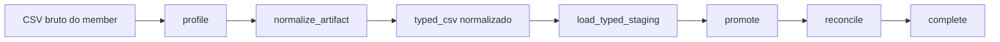

# ADR 0004: DFP/ITR usam direct path com artifacts e PostgreSQL canonico

## Status

Aceita.

## Contexto

DFP e ITR possuem members financeiros grandes. O caminho operacional desses members precisa preservar linhagem, replay, cancelamento, status por fase e promocao canonica, mas nao pode depender de gravar todas as linhas validas em staging JSON relacional antes da normalizacao.

O custo aceitavel para essas fontes fica concentrado em:

- leitura do CSV bruto persistido no artifact store;
- normalizacao em streaming;
- escrita de artifact normalizado `typed_csv`;
- carga do staging tipado via `COPY` streaming;
- promocao para as tabelas canonicas em PostgreSQL;
- reconcile por escopo;
- limpeza do staging tipado.

## Decisao

DFP e ITR seguem o **Financial Direct Path**:

Linhas validas nao sao persistidas em `ingestion_rows`. A tabela `ingestion_rows` continua disponivel para quarentena e diagnostico de linhas rejeitadas enquanto o contrato de quarentena depende de `ingestion_row_id`.

O staging financeiro tipado e transitório:

- carregado via streaming `COPY`;
- `UNLOGGED` em PostgreSQL;
- indexado apenas para filtros de member, hash e ordenacao usados pelo processamento;
- purgado ao final do member.

O PostgreSQL permanece a base canonica. NoSQL nao e usado para corrigir o gargalo porque o gargalo esta no caminho de ingestao duplicado, nao no modelo canonico relacional.

Parquet e DuckDB permanecem opcionais para benchmark posterior. O formato operacional default e `typed_csv`.

## Consequencias

- ITR/DFP reduzem escrita relacional intermediaria para linhas validas.
- Replay continua artifact-backed.
- A API operacional passa a expor fases mais especificas para members financeiros: `profile`, `normalize_artifact`, `load_typed_staging`, `promote`, `reconcile`, `complete`.
- Workers de ingestao usam filas `ingestion` e `ingestion_control`; materializacao permanece isolada em `analise_materializacao`.
- O dispatcher financeiro limita members ativos por ZIP com `INGESTION_MAX_ACTIVE_MEMBERS_PER_PARENT`, default `2`.
