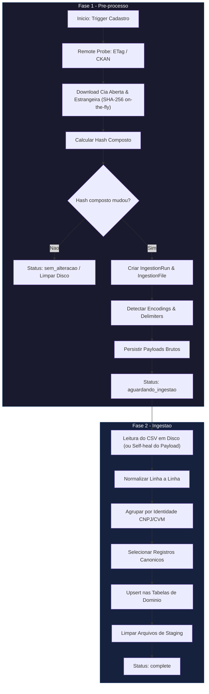

# Ingestao de Dados CVM

## 1. Visao Geral

O servico de ingestao e o pipeline de dados do Tucano-CVM. Ele substitui o sistema legado
de "sincronizacao v1" e e responsavel por:

- Baixar arquivos do portal de dados abertos da CVM (`https://dados.cvm.gov.br/dados`)
- Sondar remotamente (ETag / Last-Modified / CKAN) para detectar alteracoes antes do download
- Fazer parsing de CSV e ZIP
- Validar schemas em nivel de membro, normalizar campos e deduplicar registros
- Resolver a identidade das companhias (CNPJ / codigo CVM)
- Promover os dados para as tabelas de dominio com resiliencia a falhas por linha (savepoints aninhados)
- Rastrear mudancas estruturais entre execucoes (membros adicionados/removidos, headers alterados)
- Persistir snapshots duraveis do lifecycle (`source_artifact_snapshots`, `source_member_snapshots`, `source_delivery_snapshots`)
- Reconciliar linhas promovidas obsoletas (remover registros ausentes no pacote atual)
- Manter progresso agregado por run/membro e quarentena apenas para excecoes reais

O pipeline opera sobre **8 fontes de dados** publicas da CVM, cada uma com um conjunto
de arquivos CSV organizados em pacotes anuais (ZIP) ou arquivos unicos (cadastro).

---

## 2. Arquitetura do Sistema

### Stack Tecnologica

| Componente | Tecnologia |
|---|---|
| API HTTP | FastAPI (Python 3.12+) |
| Fila de tarefas assincronas | Celery 5.4+ |
| Broker / Result backend | Redis 7 |
| Banco de dados relacional | PostgreSQL 16 |
| ORM | SQLAlchemy 2.x |
| Migracoes | Alembic |

### Processos em Execucao

| Processo | Descricao |
|---|---|
| `cvm_api` | Servidor HTTP (uvicorn) que expoe endpoints REST, incluindo admin de ingestion |
| `cvm_worker` | Celery worker (concurrency=1, 4 replicas por padrao) que consome as tarefas de ingestion |
| `cvm_scheduler` | Celery beat + bootstrap que dispara sincronizacoes periodicas (diarias) e backfill inicial |
| `cvm_redis` | Redis 7 como broker de mensagens e result backend do Celery |

### Visao da Arquitetura

```
  CVM Dados Abertos
         |
    [Remote Probe: CKAN / HEAD / SHA fallback]
         |
    [HTTP Download opcional + SHA-256 on-the-fly]
         |
  +-----+------+
  |   Worker   |  (Celery)
  |  ingestion |
  +-----+------+
         |
    [Extracao ZIP + Deteccao de Encoding]
         |
    [Staging temporario: ingestion_rows (COPY protocol)]
         |
    [Normalizacao + Resolucao + Promocao (safe_promote_chunk)]
         |
  +------+-------+
  |  PostgreSQL  |
  |  Tabelas de  |
  |   Dominio    |
  +--------------+
         |
 [Lifecycle Snapshots + Change Tracking + Reconcile + Quarentena]
```

### Fluxo de Ingestao (Diagramas)

O pipeline de processamento e dividido em duas fases estruturadas (Pre-processamento e Ingestao) para garantir resiliencia e permitir reinicios limpos. Alem disso, o sistema persiste os payloads brutos de cada membro CSV em `ingestion_file_member_payloads` para self-healing: se um worker reiniciar entre as fases, o payload pode ser reconstruido do banco sem redownload.

#### Fluxo do Cadastro (CSV Unico)
O fluxo para a fonte `cadastro` (arquivos cadastrais unificados):



#### Fluxo dos Arquivos Anuais (Pacotes ZIP)
O fluxo para as demais fontes anuais (`dfp`, `itr`, `fre`, `fca`, `ipe`, `vlmo`, `cgvn`):

```mermaid
graph TD
    %% Phase 1
    subgraph phase1_zip ["Fase 1 - Pre-processo ZIP"]
        A1["Inicio: Trigger ZIP Anual"] --> B1["Remote Probe: CKAN / HEAD"]
        B1 --> C0{"Metadado remoto forte indica sem alteracao?"}
        C0 -- Sim --> C00["Finalizar em acquire: sem_alteracao + SourceArtifactSnapshot"]
        C0 -- Nao --> C1["Download do Arquivo ZIP (SHA-256 on-the-fly)"]
        C1 --> D1["Criar ExecucaoSincronizacao Pai e IngestionRun"]
        D1 --> D2["Confirmar SHA do artefato baixado"]
        D2 --> E1{"SHA igual a referencia anterior?"}
        E1 -- Sim --> F1["Finalizar em acquire: sem_alteracao + SourceArtifactSnapshot"]
        E1 -- Nao --> G1["Extrair Membros CSV do ZIP"]
        G1 --> G2["Persistir SourceArtifactSnapshot do pacote"]
        G2 --> H1["Para Cada Membro CSV"]
        H1 --> I1{"Membro ja Processado com Sucesso?"}
        I1 -- Sim --> J1["Registrar SourceMemberSnapshot=member_skipped"]
        I1 -- Nao --> K1["Criar Filho com status: aguardando_ingestao"]
        K1 --> L1["Detectar Encoding/Delimiter, Contar Linhas"]
        L1 --> M1["Registrar IngestionFileMember + SourceMemberSnapshot"]
        M1 --> N1["Persistir IngestionFileMemberPayload (Self-heal)"]
        N1 --> N2["Extrair SourceDeliverySnapshots quando houver indice documental"]
        N2 --> O1["Change Tracking: comparar membros, headers, row_count e delivery index"]
        O1 --> P1["Atualizar Status Pai para: aguardando_ingestao"]
    end

    %% Phase 2
    subgraph phase2_zip ["Fase 2 - Ingestao ZIP"]
        P1 --> Q1["Carregar Cache do Resolver & Grafo de Identidade"]
        Q1 --> R1["Separar Membros: Headers vs Dependentes"]
        R1 --> S1["Processar Headers Primeiro"]
        S1 --> T1["Processar Dependentes Depois (chord Celery)"]
        
        subgraph member_task ["Processamento de Membro (sincronizar_member_task)"]
            U1["Self-heal: reconstruir CSV do payload se ausente"] --> V1["Estagio: CSV para Ingestion Rows (COPY protocol)"]
            V1 --> W1["Validar Header do Membro"]
            W1 --> X1{"Schema OK?"}
            X1 -- Nao --> Y1["Registrar Falha no Membro + Atualizar Contadores"]
            X1 -- Sim --> Z1["Normalizar e Resolver em Chunks"]
            Z1 --> AA1["Promover: safe_promote_chunk (savepoints)"]
            AA1 --> AB1{"Linha com Excecao de BD?"}
            AB1 -- Nao --> AC1["Atualizar Contadores e Quality Summary"]
            AB1 -- Sim --> AD1["Rollback savepoint, promover linha a linha"]
            AD1 --> AE1["Linhas OK promovidas; erros -> Quarentena"]
            AE1 --> AC1
            AC1 --> AF0["Atualizar SourceMemberSnapshot/SourceDeliverySnapshots"]
            AF0 --> AF1["Purgar Linhas de Staging Bem-sucedidas"]
            AF1 --> AG1["Reconcile set-based: anti-join por arquivo_origem/ano_origem/hash_origem"]
        end
        
        T1 --> U1
        Y1 --> AH1["Agregar Resultados dos Filhos no Pai"]
        AG1 --> AH1
        AH1 --> AI1["Quality Gate: Verificar Falhas nos Filhos"]
        AI1 --> AJ1["Limpar Arquivos de Staging em Disco"]
        AJ1 --> AK1["Setar Status Final: sucesso / sucesso_com_alerta / falha_qualidade / falha"]
    end

    style phase1_zip fill:#1a1a2e,stroke:#0f3460,color:#fff
    style phase2_zip fill:#16213e,stroke:#0f3460,color:#fff
    style member_task fill:#0f3460,stroke:#e94560,color:#fff
```



---

## 3. Fontes de Dados

Definidas no modulo `source_registry` do pacote de ingestion.

| Fonte | Familia | Tipo | Anos | Depende de | Descricao |
|---|---|---|---|---|---|
| `cadastro` | cadastro_cvm | csv_unico | todos | -- | Cadastro de companhias abertas + emissor estrangeiro |
| `dfp` | documentos_financeiros | zip_anual | 2010+ | cadastro | Demonstracoes Financeiras Padronizadas (anuais) |
| `itr` | documentos_financeiros | zip_anual | 2010+ | cadastro | Informacoes Trimestrais |
| `fre` | formulario_referencia | zip_anual | 2010+ | cadastro | Formulario de Referencia |
| `fca` | formulario_cadastral | zip_anual | 2010+ | cadastro | Formulario Cadastral |
| `ipe` | informacoes_periodicas_eventuais | zip_anual | 2003+ | cadastro | Informacoes Periodicas e Eventuais |
| `vlmo` | valores_mobiliarios_negociados_detidos | zip_anual | 2018+ | cadastro | Valores Mobiliarios Negociados e Detidos |
| `cgvn` | governanca | zip_anual | 2018+ | cadastro | Codigo de Governanca Corporativa |

### Estrutura de uma Fonte (`FonteRegistry`)

Cada fonte possui:

- `fonte`: identificador unico (`FonteChave`)
- `familia`: agrupamento logico
- `tipo_distribuicao`: `csv_unico` (arquivo unico) ou `zip_anual` (pacote ZIP com varios CSVs)
- `dataset_path_template`: URL template para download
- `arquivo_principal_template`: nome do arquivo principal
- `primeiro_ano` / `ultimo_ano`: periodo de cobertura
- `dependencias`: fontes que precisam ser processadas antes
- `datasets`: lista de `DatasetFonte` descrevendo cada CSV dentro do ZIP
- `artifact_type`: semantica do artefato remoto (`annual_zip_replacement`, `current_snapshot`)
- `update_cadence`: cadencia operacional esperada
- `remote_probe_strategy`: estrategia de preflight remoto
- `version_semantics`: politica de retencao de `VERSAO`
- `reconcile_policy`: politica de reconcile para members alterados

### Estrutura de um Dataset (`DatasetFonte`)

| Campo | Descricao |
|---|---|
| `dataset` | Nome logico do dataset |
| `member_name_template` | Template do nome do arquivo CSV dentro do ZIP |
| `row_kind` | Tipo de linha (ex: `dfp_documento`, `fre_auditor`) |
| `destino_promovido` | Tabela de dominio alvo (`None` quando apenas staging) |
| `normalizador` | Nome da funcao normalizadora |
| `chaves_relacao` | Campos usados para relacao entre datasets |
| `obrigatorio` | Se o arquivo deve obrigatoriamente existir no ZIP |
| `status_suporte` | `suportado` ou `pendente_mapeamento` (staging apenas, sem promocao) |
| `delivery_index_role` | Se o dataset participa do snapshot documental (`document`, `none`, etc.) |
| `header_compatibility` | Regra esperada de compatibilidade de header |
| `reconcile_policy` | Politica de reconcile para o dataset |

### Cobertura de Datasets por Fonte

| Fonte | Total Datasets | Promovidos | Staging Only |
|---|---|---|---|
| `cadastro` | 2 (arquivos unicos) | 2 | 0 |
| `dfp` | 15 | 15 | 0 |
| `itr` | 15 | 15 | 0 |
| `fre` | 48 | 9 | 39 (pendente_mapeamento) |
| `fca` | 10 | 6 | 4 |
| `ipe` | 1 | 1 | 0 |
| `vlmo` | 2 | 2 | 0 |
| `cgvn` | 2 | 2 | 0 |

---

## 4. Modelo de Dados (Pipeline)

Tabelas principais do modulo `ingestion` de modelos:

### `IngestionRun`

Representa uma execucao do pipeline para uma fonte/ano.

| Coluna | Tipo | Descricao |
|---|---|---|
| `id` | UUID | Chave primaria |
| `execucao_sincronizacao_id` | UUID (FK) | Referencia a `execucoes_sincronizacao` (legado) |
| `tipo_fonte` | String(50) | Fonte sendo processada |
| `ano` | Integer | Ano de referencia |
| `status` | String(32) | Status atual da execucao |
| `phase` | String(32) | Fase atual do pipeline |
| `requested_by_task_id` | String(64) | ID da tarefa Celery que solicitou |
| `message` | Text | Mensagem de status ou erro |
| `remote_probe` | JSON | Resultado da sondagem remota (ETag, Last-Modified, CKAN) antes do download |
| `change_summary` | JSON | Resumo de mudancas estruturais entre a run atual e a anterior (membros adicionados/removidos, headers alterados) |
| `quality_summary` | JSON | Resumo consolidado de qualidade (contadores, status por membro) |
| `started_at` | DateTime | Inicio da execucao |
| `finished_at` | DateTime | Termino da execucao |

### `SourceArtifactSnapshot`

Snapshot duravel do artefato CVM observado por uma run.

| Coluna | Tipo | Descricao |
|---|---|---|
| `resource_url` | String(1000) | URL concreta do recurso CVM avaliado |
| `content_sha256` | String(64) | SHA final do payload quando houve download |
| `remote_etag` / `remote_last_modified` / `remote_content_length` | String | Metadados remotos observados |
| `package_metadata_modified` | String | Metadata CKAN quando disponivel |
| `probe_sources` | JSON | Fontes consultadas no probe (`ckan`, `head`, etc.) |
| `probe_decision` | String(32) | Decisao do preflight remoto |
| `probe_confidence` | String(32) | Confianca operacional da decisao (`strong`, `medium`, `weak`, `unknown`) |
| `download_required` | Boolean | Se o probe exigiu download para confirmacao |
| `sha_confirmation_result` | String(32) | Resultado final da confirmacao por SHA (`equal`, `different`, etc.) |
| `status` | String(32) | Estado final do snapshot |

### `IngestionFile`

Arquivo baixado (ZIP ou CSV).

| Coluna | Descricao |
|---|---|
| `source_url` | URL de origem |
| `source_filename` | Nome do arquivo |
| `content_sha256` | Hash SHA-256 do conteudo |
| `content_length_bytes` | Tamanho em bytes |
| `http_status_code` | Status HTTP do download |
| `etag` / `last_modified` | Metadados HTTP |
| `is_zip` | Se o arquivo e um pacote ZIP |
| `already_seen_success` | Se ja foi processado com sucesso antes |

### `IngestionFileMember`

Membro dentro de um ZIP (ou CSV unico).

| Coluna | Descricao |
|---|---|
| `member_name` | Nome do CSV |
| `member_sha256` | Hash do conteudo |
| `member_size_bytes` | Tamanho |
| `encoding` | Encoding detectado (utf-8-sig / latin1) |
| `delimiter` | Delimitador (padrao `;`) |
| `header` | Lista de colunas (JSON) |
| `row_count` | Quantidade de linhas |
| `schema_status` | Status da validacao do schema |
| `schema_message` | Mensagem de validacao |

### `SourceMemberSnapshot`

Snapshot duravel de cada member observado no artefato atual.

| Coluna | Descricao |
|---|---|
| `member_name` | Nome do CSV dentro do ZIP |
| `member_sha256` | Hash do payload bruto do member |
| `row_count` | Quantidade de linhas do member |
| `header_hash` / `header` | Header bruto e hash do header |
| `row_kind` | Tipo interno associado ao member |
| `required_member` | Se o member e obrigatorio segundo o `source_registry` |
| `schema_status` / `schema_message` | Resultado da validacao de schema |
| `delivery_index_role` | Se o member alimenta `source_delivery_snapshots` |
| `lifecycle_status` | `processed`, `member_skipped`, `schema_invalid`, etc. |

### `SourceDeliverySnapshot`

Snapshot duravel do indice documental extraido de members com papel de cabecalho/documento.

| Coluna | Descricao |
|---|---|
| `identity_hash` | Hash canonico da identidade documental extraida |
| `cnpj_companhia` / `codigo_cvm` | Identificadores basicos da companhia |
| `id_documento` | ID do documento quando presente |
| `protocolo_entrega` | Protocolo de entrega CVM quando presente |
| `data_referencia` / `data_entrega` | Datas documentais |
| `versao` | `VERSAO` publicada pela CVM |
| `raw_identity` | Recorte bruto da identidade documental capturada |
| `status` | Estado do snapshot (`captured`, etc.) |

### `IngestionRow`

Uma linha de CSV staged de forma **temporaria** para processamento ativo ou replay.
Nao deve ser tratada como trilha duravel de sucesso apos a promocao.

| Coluna | Descricao |
|---|---|
| `raw_data` | Dados brutos (JSON) |
| `raw_hash` | Hash dos dados brutos |
| `normalized_data` | Dados normalizados (uso temporario / excecoes) |
| `normalized_hash` | Hash dos dados normalizados (uso temporario / excecoes) |
| `row_kind` | Tipo de linha (ex: `dfp_documento`) |
| `natural_key` | Chave natural para dedup (JSON) |
| `validation_status` | Status temporario da validacao durante processamento ativo (default: `pending`) |
| `validation_reason_code` | Codigo do motivo de rejeicao para excecoes |
| `validation_details` | Detalhes da validacao para excecoes |
| `resolved_companhia_id` | FK para `companhias` quando a linha excepcional precisa ser preservada |
| `resolution_method` | Metodo de resolucao usado para excecoes/replay |
| `resolution_confidence` | Confianca da resolucao para excecoes/replay |
| `promoted_entity` | Entidade de dominio promovida (uso transitorio) |
| `promoted_entity_id` | ID da entidade promovida (uso transitorio) |

### `IngestionRowEvent`

Auditoria de excecoes e replay. O caminho de sucesso nao deve depender de eventos por linha.

| Coluna | Descricao |
|---|---|
| `event_type` | `validated`, `quarantined`, `resolved`, `replayed`, etc. |
| `event_payload` | Dados do evento (JSON) |
| `created_by` | Identificador de quem criou |

### `IngestionAttempt`

Rastreamento de tentativas de operacoes (download, processamento).

| Coluna | Descricao |
|---|---|
| `operation` | Nome da operacao |
| `attempt_number` | Numero da tentativa |
| `error_type` | Tipo do erro |
| `error_message` | Mensagem de erro |
| `next_retry_at` | Proxima tentativa agendada |

### `QuarantineItem`

Linhas rejeitadas por erro real de linha. Falhas de schema em nivel de membro sao agregadas em resumo/status e nao explodem a quarentena automaticamente.

| Coluna | Descricao |
|---|---|
| `motivo_codigo` | Codigo do motivo (`companhia_nao_encontrada`, `chave_natural_duplicada_conflitante`, `normalizacao_invalida`, `schema_inesperado`, etc.) |
| `severidade` | `error` ou `warning` |
| `reparavel` | Se pode ser automaticamente reparado via replay |
| `tentativas_reprocessamento` | Contagem de tentativas de reprocessamento |
| `resolvido_em` / `resolvido_por` | Quando e por quem foi resolvido |

### `IngestionFileMemberPayload`

Armazenamento binario duravel do payload bruto do membro (`LargeBinary`). E a base para self-healing e replay de runs/membros sem depender da permanencia das linhas bem-sucedidas em staging. Se um worker reiniciar entre as fases e o arquivo CSV em disco for perdido, o sistema reconstroi o arquivo a partir deste payload.

## 5. Pipeline de Ingestao

O pipeline opera em **duas fases** para todas as fontes. A separacao permite que o sistema
sobreviva a restart entre as fases. A persistencia dos payloads brutos em
`IngestionFileMemberPayload` garante self-healing completo: o CSV do membro pode ser
reconstruido do banco sem redownload.

### 5.1 Fluxo Cadastro (CSV Unico)

A fonte `cadastro` e especial: sao dois CSV baixados diretamente (sem ZIP) e processados
de forma integrada.

#### Fase 1 — Pre-processo (`pre_processar_cadastro`)

1. Sondagem remota via CKAN metadata API e HTTP HEAD (ETag / Last-Modified)
2. Download de `cad_cia_aberta.csv` e `cad_cia_estrang.csv` do portal CVM, com SHA-256 computado on-the-fly
3. Computacao de hash composto
4. Verificacao de duplicidade via `buscar_execucao_hash_existente`
5. Se o hash composto for igual ao baseline anterior: status = `sem_alteracao`, limpeza de disco
6. Se novo: criacao de `IngestionRun`, `IngestionFile` (2), `IngestionFileMember` (2)
7. Deteccao de encoding/delimiter, leitura de header e contagem de linhas
8. Persistencia dos payloads brutos em `IngestionFileMemberPayload`
9. Status: `aguardando_ingestao`

#### Fase 2 — Ingestao (`ingerir_cadastro`)

1. Leitura dos CSV do disco (ou self-heal dos payloads se arquivos ausentes)
2. Normalizacao linha a linha:
   - `normalizar_linha_cadastro_aberta` (50 campos: CNPJ, CD_CVM, denominacao, endereco, responsavel, etc.)
   - `normalizar_linha_cadastro_estrangeira` (estrutura similar, sem tipo_mercado)
3. Agrupamento por identidade (CNPJ ou codigo CVM)
4. Selecao do registro canonico por grupo:
   - Prioridade: situacao ATIVO > sem cancelamento > data inicio mais recente > data registro mais recente > fonte aberta > linha origem
5. Upsert em 4 tabelas de dominio:
   - `Companhia` (registro mestre)
   - `CompanhiaRegistroCvm` (cada linha de cadastro historico)
   - `CompanhiaMercado` (tipo de mercado, quando presente)
   - `CompanhiaIdentificador` (CNPJ + codigo CVM normalizados)
6. Limpeza dos arquivos em disco

### 5.2 Fluxo ZIP (dfp, itr, fre, fca, ipe, vlmo, cgvn)

#### Lifecycle real dos arquivos CVM

A CVM republica arquivos anuais por **substituicao completa do artefato**, nao por append incremental.
Isso produz tres efeitos importantes no pipeline:

1. O mesmo ZIP anual pode mudar sem trocar o nome do arquivo.
2. Dentro de um ZIP alterado, alguns members podem permanecer identicos e ser reaproveitados por `member_sha256`.
3. Um member alterado pode remover linhas antes publicadas; por isso a promocao precisa ser seguida de `reconcile`.
4. Se uma execucao anual falhar depois que alguns members ja foram promovidos com sucesso, esses members bem-sucedidos continuam sendo baseline valido de reaproveitamento em reruns futuros do mesmo ano, desde que o `member_sha256` permaneça igual.

O sistema nao colapsa `VERSAO` no momento da ingestao. Para fontes documentais, todas as versoes recebidas da CVM continuam retidas nas tabelas de dominio; o lifecycle corrige apenas o espelho local do member corrente, removendo linhas que desapareceram do artefato atual.

#### Fase 1 — Pre-processo (`pre_processar_sincronizacao_zip`)

1. Sondagem remota via CKAN metadata API e HTTP HEAD (ETag / Last-Modified / Content-Length)
2. Download do ZIP: `{fonte}_cia_aberta_{ano}.zip` com SHA-256 computado on-the-fly
3. Criacao de `ExecucaoSincronizacao` pai com `tipo_execucao="arquivo_zip"`
4. Se o probe remoto trouxer evidencia forte de igualdade: encerramento direto em `sem_alteracao`, sem download
5. Se houve download, o SHA final e comparado com a referencia anterior; se igual, a run termina em `sem_alteracao`
6. Criacao de `IngestionRun`, `IngestionFile` (quando houve download) e `SourceArtifactSnapshot`
6. Extracao dos membros CSV do ZIP em ordem definida pelo `source_registry`
7. Para cada membro:
   - Extracao do CSV para disco
   - Computacao de hash do membro
   - Se ja foi processado com sucesso antes (`member_has_successful_match`):
     - O member nao entra em `stage -> promote`
     - Registra `SourceMemberSnapshot` com `lifecycle_status=member_skipped`
     - Em reruns de recuperacao, o reaproveitamento pode vir de um member bem-sucedido pertencente a uma execucao anual pai que terminou em `falha`
   - Se novo:
     - Cria `ExecucaoSincronizacao` filho com `tipo_execucao="arquivo_membro"` e `status=aguardando_ingestao`
     - Cria `IngestionRun` filho
     - Detecta encoding/delimiter, le header e conta linhas
     - Registra `IngestionFileMember` e `SourceMemberSnapshot`
     - Persiste `IngestionFileMemberPayload` com o payload bruto do CSV membro (self-healing)
     - Extrai `SourceDeliverySnapshots` quando o member tem papel documental
8. Change tracking: compara membros atuais com a ultima run de sucesso (adicoes, remocoes, alteracoes de header/schema, mudanca de row_count e drift do delivery index)
9. Pai atualizado para `aguardando_ingestao`

#### Semantica de rerun parcial

Quando um ZIP anual falha em apenas alguns members, o rerun normal da mesma fonte/ano deve ser entendido como **rerun de recuperacao**:

1. o artefato anual ainda passa por probe remoto e, se necessario, download
2. cada member do ZIP atual e comparado por `member_sha256` contra resultados anteriores reaproveitaveis
3. members ja bem-sucedidos e inalterados sao reaproveitados, com `lifecycle_status=member_skipped` e counters especificos de recovery
4. apenas members falhados, interrompidos, ausentes ou com SHA alterado seguem para `stage -> promote -> reconcile`

O endpoint de reprocessamento seletivo continua existindo para recuperacao cirurgica, mas nao deve ser necessario para o caso comum de "3 arquivos falharam em 19".

#### Fase 2 — Ingestao (`ingerir_sincronizacao_zip`)

1. Carrega caches do resolver de identidade
2. Verifica se o grafo de identidade esta pronto (`ensure_identity_graph_ready`)
3. Separa membros em duas categorias:
   - **Document headers**: arquivo principal `{fonte}_cia_aberta_{ano}.csv` (processado primeiro)
   - **Dependentes**: demais arquivos (processados apos os headers)
4. Orquestracao via Celery: `chain(header_task, chord(dependent_tasks, finalize_task))`
5. Dispara `sincronizar_member_task` para cada membro:
   - **Self-heal**: se arquivo CSV ausente do disco, reconstroi de `IngestionFileMemberPayload` ou re-extrai do ZIP
   - **Stage**: CSV para `ingestion_rows` em chunks (default 5.000 linhas/chunk), usando PostgreSQL COPY protocol quando disponivel para performance
   - Determinacao do `row_kind` via `get_row_kind`
   - Reconstrucao do `header_map` para datasets dependentes
   - Processamento especifico por tipo de fonte:
     - `dfp`/`itr`: `_process_financeiro_member`
     - `fre`: `_process_fre_member`
     - `fca`: `_process_fca_rows`
     - `ipe`: `_process_ipe_rows`
     - `vlmo`: `_process_vlmo_rows`
     - `cgvn`: `_process_cgvn_rows`
   - **Promocao resiliente** (`safe_promote_chunk`): promove em chunks. Se o chunk inteiro falhar (ex: `NumericValueOutOfRange`), faz rollback do savepoint e promove linha a linha. Linhas com erro vao para quarentena com `normalizacao_invalida`; linhas OK sao salvas.
   - **Lookup leve antes do promote**: a camada de ingestao consulta primeiro apenas `id` + chave natural + `hash_origem`; a leitura completa dos campos de negocio so acontece para chaves cujo hash mudou.
   - **Insercao nova no PostgreSQL**: o caminho de insert usa `ON CONFLICT DO NOTHING` nas tabelas com chave natural estavel para reduzir custo de corrida e duplicidade intra-batch sem alterar a trilha de historico.
   - Para linhas bem-sucedidas: atualizacao de contadores
   - Para excecoes de linha: persistencia de quarentena e diagnostico
   - Ao final do membro: purge das linhas staged bem-sucedidas
   - **Reconcile**: carrega `id` + `hash_origem` do escopo atual (`arquivo_origem`/`ano_origem`), compara com os hashes promovidos com sucesso no member atual e remove em lotes apenas os IDs obsoletos
6. Agregacao dos resultados filhos no pai
7. Quality gate: se algum filho falhou, pai falha
8. Limpeza dos arquivos em disco

#### Processamento Interno de Membro (`sincronizar_member_task`)

Para cada membro, o pipeline interno e:

```
self-heal (reconstruir CSV se ausente)
  -> stage temporario (CSV -> ingestion_rows via COPY protocol, chunks de 5000)
  -> validate header do membro
  -> normalize/resolve/promote em chunks com safe_promote_chunk (savepoints)
  -> persist only exceptions
  -> update progress + quality summary
  -> purge success rows from staging
  -> reconcile (remover registros obsoletos do dominio)
```

---

## 6. Fases e Status

### Fases do Pipeline (`phase`)

| Fase | Descricao |
|---|---|
| `acquire` | Sondagem remota + download do arquivo da CVM |
| `stage` | Parsing do CSV e insercao em `ingestion_rows` |
| `validate` | Validacao de header, normalizacao e dedup |
| `resolve` | Resolucao de identidade da companhia |
| `promote` | Escrita nas tabelas de dominio |
| `complete` | Pipeline finalizado |

### Status de Execucao

| Status | Descricao |
|---|---|
| `em_execucao` | Pipeline em andamento |
| `aguardando_ingestao` | Pre-processo concluido, aguardando ingestao |
| `sucesso` | Processado com sucesso |
| `sucesso_com_alerta` | Processado com alertas (ex: erros de schema) |
| `sem_alteracao` | Artefato remoto ou hash final confirmaram igualdade com o baseline anterior |
| `skipped` | Skip operacional legado ou decisao administrativa explicita |
| `falha` | Falha no processamento |
| `falha_qualidade` | Falha no quality gate (ex: muitas companhias nao encontradas) |

---

## 7. Validacao e Qualidade

### Validacao de Schema (modulo `validation`)

Cada `row_kind` possui um conjunto de colunas obrigatorias definidas em
`_REQUIRED_COLUMNS_BY_ROW_KIND`. Mais de 80 row kinds sao mapeados. Exemplos:

| row_kind | Colunas Obrigatorias |
|---|---|
| `dfp_documento` | `CNPJ_CIA`, `DT_REFER`, `VERSAO`, `ID_DOC` |
| `fre_documento` | `CNPJ_CIA`, `DT_REFER`, `VERSAO`, `ID_DOC` |
| `fre_auditor` | `CNPJ_Companhia`, `Data_Referencia`, `Versao`, `ID_Documento`, `ID_Auditor` |
| `vlmo_consolidado` | `CNPJ_Companhia`, `Nome_Companhia`, `Data_Referencia`, `Versao`, `Tipo_Empresa`, etc. (17 colunas) |

Resultados da validacao:

- `valid` — todos os requisitos atendidos
- `invalid` com `schema_inesperado` — colunas obrigatorias ausentes
- `invalid` com `normalizacao_invalida` — erro de conversao de tipo ou parse (decimais, inteiros, datas) ou erro de banco de dados durante a promocao

Na arquitetura simplificada, `schema_inesperado` e tratado como falha em nivel de membro.
O pipeline atualiza contadores e status do membro, mas nao cria automaticamente um item de quarentena por linha.

### Contrato Numerico para Dados CVM Estruturados

Para arquivos estruturados da CVM ingeridos por este projeto, o contrato numerico passa a ser explicitamente separado em tres camadas:

- Ingestao CVM: o parser trata `.` como separador decimal de maquina e nao aceita separadores de milhares em campos numericos estruturados.
- Escala monetaria: fatores como `UNIDADE`, `MIL` e `MILHAO` sao aplicados apenas a partir da coluna `ESCALA_MOEDA` ou metadado equivalente, nunca inferidos da pontuacao.
- API e exportacao: valores decimais saem como strings decimais canonicas, sem separadores de milhares, sem arredondamento e sem localizacao pt-BR.

Implicacoes operacionais:

- `1.230` em dado estruturado CVM significa `1.230`, nao `1230`.
- `1230` significa mil duzentos e trinta.
- `1.000,00` e rejeitado em DFP/ITR estruturado porque mistura separador de milhares com separador decimal localizado.
- Valores como `205431960490.5200000000` sao normalizados para a representacao canonica `205431960490.52` na saida da API, sem perda de precisao.
- Registros com `ESCALA_MOEDA` ausente ou desconhecida sao rejeitados/quarentenados em vez de assumir fator `1`.

No endpoint de exportacao em lote `/exportacoes/{fonte}/{dataset}`:

- `formato=json` retorna um array de objetos por streaming com datas em `DD/MM/AAAA`, datetimes em `DD/MM/AAAA HH:MM:SS` e decimais como string decimal canonica.
- `formato=csv` retorna o mesmo contrato semantico em texto CSV, preservando os mesmos valores normalizados.
- O endpoint limita a resposta a 100.000 registros por chamada.
- `ano_inicio` e `ano_fim` formam um intervalo inclusivo; chamadas com `ano_inicio > ano_fim` sao rejeitadas com `422`.

Continuam aceitos durante a normalizacao generica, quando aplicavel fora do contrato estruturado DFP/ITR:

- Representacoes textuais de nulos (ex: `N/A`, `N.D.`, `-`)
- Alguns simbolos monetarios e percentuais em campos nao estruturados ou historicos
- Campos de texto livre em colunas originalmente esperadas como numericas, com fallback para tipo `Text` quando o dataset assim exigir

### Construcao de Chave Natural

Cada `row_kind` possui um builder de chave natural especifico. Exemplos:

- `dfp_documento`: `{tipo_formulario, id_documento, versao, data_referencia}`
- `dfp_demonstracao`: `{tipo_formulario, tipo_demonstracao, escopo_demonstracao, cnpj_companhia, ..., codigo_conta}`
- `fre_auditor`: `{id_documento, versao, data_referencia, cnpj_companhia, id_auditor}`

### Classificacao de Duplicatas

`classify_duplicate()` compara a chave natural + hash normalizado:

| Resultado | Descricao |
|---|---|
| `new` | Primeira ocorrencia da chave natural |
| `ignored_duplicate` | Mesma chave natural + mesmo hash (registro identico) |
| `chave_natural_duplicada_conflitante` | Mesma chave natural, hash diferente (conflito, reparavel) |

### Quality Gate (modulo `quality`)

Aplicado ao final do processamento de cada membro. Verifica:

- Razo de `companhia_nao_encontrada` < `INGESTION_COMPANY_MISSING_MAX_RATIO` (padrao 1%)
- Erros de schema produzem `sucesso_com_alerta`
- Violacao do limite produz `falha_qualidade`

---

## 8. Resolucao de Identidade (modulo `resolver`)

### Estrategia em Cascata

A resolucao da companhia para cada linha segue 5 estrategias em ordem de precedencia:

1. **Identificador exato** (cache na sessao):
   - Busca por CNPJ em `CompanhiaIdentificador` (tipo="cnpj")
   - Busca por codigo CVM em `CompanhiaIdentificador` (tipo="codigo_cvm")
   - Se ambos encontrados e convergem para mesma companhia: confianca **alta**
   - Se apenas um encontrado: confianca **alta**

2. **Header de documento**:
   - Para linhas filhas (demonstracoes, auditores, etc.), usa a companhia ja resolvida do documento header
   - Cache em `header_map` (dict na memoria, chave = tipo_formulario + id_documento + versao + data_referencia)
   - Confianca: **media**

3. **Regras de reparo** (`RepairRule`):
   - Regras manuais do tipo `identity_exact`
   - Match por payload (campos especificos mapeados para companhia_id)
   - Confianca: **media**

4. **Tabela legada `Companhia`**:
   - Cache carregado no inicio da sessao
   - Busca por CNPJ e/ou codigo CVM
   - Confianca: **alta**

5. **Criacao provisoria** (feature flag `INGESTION_PROVISIONAL_COMPANY_ENABLED`):
   - Cria `Companhia` com `tipo_emissor="provisorio"`, `qualidade_identidade="baixa"`
   - CNPJ provisorio baseado no codigo CVM
   - Atualiza caches em memoria para uso imediato
   - Confianca: **baixa**

### Resultados

| Status | Confianca | Descricao |
|---|---|---|
| `RESOLVED` | alta / media | Companhia encontrada |
| `AMBIGUOUS` | -- | Identificador aponta para multiplas companhias |
| `NOT_FOUND` | -- | Nenhuma estrategia resolveu |
| `PROVISIONAL_CREATED` | baixa | Companhia provisoria criada |

---

## 9. Quarentena e Replay

### Quarentena (modulo `quarantine`)

Linhas invalidas de fato sao registradas em `QuarantineItem` com:

| Campo | Descricao |
|---|---|
| `motivo_codigo` | Codigo estavel do motivo |
| `severidade` | `error` ou `warning` |
| `reparavel` | Se o item pode ser automaticamente reparado |
| `tentativas_reprocessamento` | Numero de tentativas de reprocessamento |
| `ultimo_erro` | Mensagem do ultimo erro |

Principais codigos de motivo:

| Codigo | Descricao | Reparavel |
|---|---|---|
| `companhia_nao_encontrada` | Empresa nao encontrada no grafo de identidade | Sim |
| `chave_natural_duplicada_conflitante` | Chave natural duplicada com dados divergentes | Sim |
| `normalizacao_invalida` | Erro de conversao/parse ou falha de banco de dados durante promocao (ex: `NumericValueOutOfRange`, estouro de campo texto, violacao de integridade) | Nao |
| `schema_inesperado` | Colunas obrigatorias ausentes no membro | Sim, mas registrada no resumo do membro antes de qualquer expansao por linha |
| `denominacao_social_ausente` | Nao foi possivel extrair a denominacao social | Nao |
| `identidade_ausente` | Nem CNPJ nem codigo CVM disponiveis | Nao |
| `companhia_ambigua` | CNPJ aponta para uma empresa e codigo CVM para outra | Sim |

### Promocao Resiliente (`safe_promote_chunk`)

Durante a promocao para tabelas de dominio, o sistema utiliza savepoints aninhados
(`db.begin_nested()`) para isolar falhas:

1. Tenta promover o chunk inteiro em lote
2. Se falhar (ex: `NumericValueOutOfRange` em uma linha), faz rollback do savepoint
3. Promove cada linha individualmente com seu proprio savepoint
4. Linhas que falham vao para quarentena com `normalizacao_invalida` e detalhes do erro
5. Linhas OK sao commitadas normalmente
6. O processamento do membro continua sem abortar

Este mecanismo garante que um unico registro problematico (ex: um valor numerico que excede a precisao da coluna) nao bloqueie toda a ingestao do arquivo.

### Replay (modulo `replay`)

Tres niveis de replay:

1. **Linha individual** (`replay_ingestion_row`):
   - Usado apenas para excecoes reais de linha
   - Renormaliza, re-resolve e re-promove uma unica linha rejeitada
   - Resiliente: falha em uma linha especifica nao aborta o replay das demais

2. **Run/membro completo** (`replay_ingestion_run`):
   - Reconstroi o processamento a partir de `IngestionFileMemberPayload`
   - Nao depende da permanencia das linhas bem-sucedidas em `ingestion_rows`
   - Passa novamente por stage, promote e reconcile

3. **Lote de quarentena** (`replay_quarantine`):
   - Replay de todos os itens pendentes na quarentena
   - Filtros opcionais: `reason_code`, `arquivo_origem`, `ano`
   - Opera apenas sobre excecoes persistidas

---

## 10. Deduplicacao e Change Tracking

### Niveis de Deduplicacao

| Nivel | Mecanismo | Descricao |
|---|---|---|
| Remoto (pre-download) | HTTP HEAD (ETag/Last-Modified) + CKAN metadata API | `acquire_with_probe_and_retry` verifica metadados remotos antes do download para evitar download desnecessario |
| Arquivo | SHA-256 do conteudo | `buscar_execucao_hash_existente` compara hash contra execucoes anteriores |
| Membro CSV | SHA-256 do conteudo | `member_has_successful_match` verifica se mesmo hash ja foi processado com sucesso |
| Linha | Chave natural + hash normalizado | `classify_duplicate` detecta registros identicos ou conflitantes |

### Change Tracking (modulo `change_tracking`)

Ao final da Fase 1, o sistema compara a estrutura do pacote atual com a ultima run bem-sucedida
para a mesma fonte/ano. Sao rastreadas as seguintes mudancas:

| Mudanca | Descricao |
|---|---|
| `member_added` | Membros CSV presentes agora e ausentes na run anterior |
| `member_removed` | Membros CSV ausentes agora e presentes na run anterior |
| `required_member_missing` | Membros obrigatorios (`obrigatorio=True`) ausentes no pacote atual |
| `optional_member_missing` | Membros opcionais ausentes no pacote atual |
| `header_changed` | Colunas do header do CSV alteradas entre runs (antes/depois) |
| `schema_changed` | Status de schema do membro alterado entre runs |

### Reconcile de Linhas Promovidas

Apos a promocao, o sistema remove das tabelas de dominio os registros que estavam presentes
na run anterior mas nao aparecem no pacote atual. Isso garante que dados obsoletos (ex:
empresas que deixaram de ser listadas) sejam removidos. A operacao le `id` + `hash_origem`
do escopo atual, identifica os registros ausentes no conjunto promovido e executa `DELETE`
em batches de 5.000 IDs para evitar statements SQL excessivamente grandes.

### Otimizacoes Atuais do Promote

O hot path atual de promote segue esta ordem:

1. lookup leve por chave natural com `hash_origem`
2. classificacao local entre `inserido`, `inalterado` e `potencialmente alterado`
3. lookup completo apenas das chaves realmente alteradas
4. insert em lote
5. update em lote das colunas operacionais e dos campos alterados
6. persistencia de historico campo a campo apenas quando houve mudanca real

No PostgreSQL, os inserts novos usam `ON CONFLICT DO NOTHING` quando a chave natural ja esta
fechada e testada. Isso reduz round-trips e falhas por unicidade sem mudar o contrato de
`alterado_em`, historico ou contadores.

---

## 11. Gatilhos de Execucao

### 11.1 Celery Beat (Agendamento Diario)

Definido no modulo `celery_app`. Horarios em timezone `America/Sao_Paulo`:

```python
# Cadastro — 01:00 diario
"sincronizar-cadastro-diario": crontab(hour=1, minute=0)

# Fontes anuais — a partir de 02:00 com offsets de 5 min por fonte/ano
# Para cada fonte configurada em ANOS_INICIAIS_*
"sincronizar-{fonte}-{ano}-diario": crontab(hour=2 + offset//60, minute=offset % 60)
```

As tarefas anuais usam offset progressivo de 5 minutos entre cada combinacao fonte/ano para
evitar picos de carga. Exemplo: DFP 2010 as 02:00, DFP 2011 as 02:05, ITR 2010 as 02:10, etc.

### 11.2 Bootstrap (Sincronizacao Inicial)

No modulo `bootstrap`: na inicializacao do scheduler, verifica se existem
execucoes validas. Se nao, dispara tarefas para cadastro e todas as fontes/anos
configurados via environment variables (`ANOS_INICIAIS_*`).

### 11.3 Admin API (Endpoints de Ingestao)

Endpoints no router `admin` (todos requerem autenticacao Bearer token):

**Disparo de sincronizacoes:**

| Metodo | Rota | Descricao |
|---|---|---|
| `POST` | `/admin/sincronizacoes/cadastro` | Dispara sincronizacao completa do cadastro |
| `POST` | `/admin/sincronizacoes/dfp/{ano}` | Dispara sincronizacao DFP para o ano |
| `POST` | `/admin/sincronizacoes/itr/{ano}` | Dispara sincronizacao ITR para o ano |
| `POST` | `/admin/sincronizacoes/fre/{ano}` | Dispara sincronizacao FRE para o ano |
| `POST` | `/admin/sincronizacoes/fca/{ano}` | Dispara sincronizacao FCA para o ano |
| `POST` | `/admin/sincronizacoes/ipe/{ano}` | Dispara sincronizacao IPE para o ano |
| `POST` | `/admin/sincronizacoes/vlmo/{ano}` | Dispara sincronizacao VLMO para o ano |
| `POST` | `/admin/sincronizacoes/cgvn/{ano}` | Dispara sincronizacao CGVN para o ano |
| `POST` | `/admin/sincronizacoes/tudo/{ano}` | Dispara todas as fontes para o ano de uma vez |
| `POST` | `/admin/sincronizacoes/reprocessar-arquivo` | Reprocessamento seletivo por nome de arquivo CVM |

Todas as rotas de disparo aceitam `?force_reimport=true` para ignorar o skip por hash e
reprocessar integralmente.
No reprocessamento seletivo por `arquivo`, a comparacao do nome e case-insensitive para
aceitar members CVM com siglas em maiusculas no nome do CSV. Depois da validacao, o
backend preserva o nome canonico do arquivo para persistencia da execucao filha e para
extracao do member no ZIP.
Durante o replay isolado de um member, a resolucao por cabecalho de documento e semeada
pelas tabelas canonicas de documentos ja promovidos, evitando reconstruir em memoria o
historico cumulativo de staging de siblings do mesmo ano.
O promote por member tambem processa os chunks de staging de forma estritamente incremental:
o worker carrega apenas os campos minimos por `ingestion_row` e desaloca os rows de cada
chunk antes de avancar para o seguinte.

**Execucao em duas fases (manual):**

| Metodo | Rota | Descricao |
|---|---|---|
| `POST` | `/admin/sincronizacoes/pre-processar/cadastro` | Fase 1 apenas do cadastro |
| `POST` | `/admin/sincronizacoes/pre-processar/{tipo_fonte}/{ano}` | Fase 1 apenas para fonte anual |
| `POST` | `/admin/sincronizacoes/{id_execucao}/ingerir` | Fase 2 a partir de execucao pre-processada |
| `POST` | `/admin/sincronizacoes/cancelar` | Cancela sincronizacao em andamento |

**Monitoramento:**

| Metodo | Rota | Descricao |
|---|---|---|
| `GET` | `/admin/sincronizacoes` | Lista paginada de execucoes de sincronizacao |
| `GET` | `/admin/sincronizacoes/{id_execucao}` | Detalhe de uma execucao |
| `GET` | `/admin/runs` | Lista paginada de ingestion runs |
| `GET` | `/admin/runs/{run_id}` | Detalhe de uma ingestion run |
| `GET` | `/admin/quarentena` | Lista paginada da quarentena (filtros: motivo_codigo, arquivo_origem, status, ano_origem) |
| `GET` | `/admin/quarentena/resumo` | Resumo analitico agregado da quarentena (totais, distribuicao, rankings) |

**Replay e correcao:**

| Metodo | Rota | Descricao |
|---|---|---|
| `POST` | `/admin/replay/quarentena` | Replay de itens da quarentena (filtros opcionais) |
| `POST` | `/admin/runs/{run_id}/replay` | Replay de uma run completa a partir do payload bruto |
| `POST` | `/admin/identity/rebuild` | Reconstroi o grafo de identidade reprocessando o cadastro |

### 11.4 Tasks Celery

Todas as tarefas usam `autoretry_for` com backoff exponencial + jitter. Excecoes que disparam retry:

- `httpx.TimeoutException`
- `httpx.TransportError`
- `RetryableIngestionError`
- `RetryableHttpStatus`
- `DependencyNotReady`
- `sqlalchemy.exc.OperationalError`
- `sqlalchemy.exc.InterfaceError`

Configuracao: maximo de `INGESTION_MAX_RETRIES` tentativas (padrao 5), backoff maximo de `INGESTION_RETRY_BACKOFF_MAX_SECONDS` (padrao 600s).

| Nome da Task | Funcao | Gatilho |
|---|---|---|
| `sincronizar_cadastro_companhias_task` | Sincronizacao completa do cadastro | Beat + Bootstrap + Admin API |
| `sincronizar_dfp_task` | `_coordenar_sincronizacao_zip("dfp", ano)` | Beat + Bootstrap + Admin API |
| `sincronizar_itr_task` | `_coordenar_sincronizacao_zip("itr", ano)` | Beat + Bootstrap + Admin API |
| `sincronizar_fre_task` | `_coordenar_sincronizacao_zip("fre", ano)` | Beat + Bootstrap + Admin API |
| `sincronizar_fca_task` | `_coordenar_sincronizacao_zip("fca", ano)` | Beat + Bootstrap + Admin API |
| `sincronizar_ipe_task` | `_coordenar_sincronizacao_zip("ipe", ano)` | Beat + Bootstrap + Admin API |
| `sincronizar_vlmo_task` | `_coordenar_sincronizacao_zip("vlmo", ano)` | Beat + Bootstrap + Admin API |
| `sincronizar_cgvn_task` | `_coordenar_sincronizacao_zip("cgvn", ano)` | Beat + Bootstrap + Admin API |
| `sincronizar_member_task` | Processamento de membro individual | Disparada por `ingerir_sincronizacao_zip` via chord |
| `pre_processar_sincronizacao_task` | Fase 1 manual (qualquer fonte) | Admin API (pre-processar) |
| `ingerir_sincronizacao_task` | Fase 2 manual | Admin API (ingerir) |

---

## 12. Processadores por Dominio

Cada fonte possui um modulo especifico no pacote de ingestion que implementa
a normalizacao, validacao e promocao para as tabelas de dominio.

### Cadastro (modulo `cadastro`)

Processa o cadastro de companhias abertas e estrangeiras.

- Normalizadores: `normalizar_linha_cadastro_aberta`, `normalizar_linha_cadastro_estrangeira`
- Promocao: `promover_registros_cadastro` -> upsert em `Companhia`, `CompanhiaRegistroCvm`, `CompanhiaMercado`, `CompanhiaIdentificador`

### Financeiro (modulo `financeiro`)

Processa DFP e ITR.

- Datasets: documento, demonstracoes financeiras (multiplos tipos como BPA, BPP, DRE, DFC, etc.), composicao de capital, parecer
- Normalizador compartilhado: `normalizar_financeiro_row`
- Promocao: `DocumentoFinanceiro`, `DemonstracaoFinanceira`, `ComposicaoCapital`, `ParecerFinanceiro`
- Ordem: documento header primeiro, depois demonstracoes, composicao, parecer

### FRE (modulo `fre`)

Processa o Formulario de Referencia.

- 48 datasets no total, sendo 9 promovidos e 39 pendentes de mapeamento (`status_suporte="pendente_mapeamento"`)
- Datasets promovidos: documento, auditor, capital_social, posicao_acionaria, remuneracao_total_orgao, empregado_posicao_genero, responsavel + classes/titulos relacionados
- Normalizador: `normalizar_fre_row`
- Promocao: `FreDocumento`, `FreAuditor`, `FreCapitalSocial`, `FrePosicaoAcionaria`, `FreRemuneracaoTotalOrgao`, `FreEmpregadoPosicaoGenero`, `FreResponsavel`, etc.

### FCA (modulo `fca`)

Processa o Formulario Cadastral.

- 10 datasets: 6 promovidos (documento, geral, endereco, dri, auditor, valor_mobiliario), 4 staging-only (escriturador, canal_divulgacao, departamento_acionistas, pais_estrangeiro_negociacao)
- Normalizador: `normalizar_fca_row`

### IPE (modulo `ipe`)

Processa Informacoes Periodicas e Eventuais.

- 1 dataset (documento principal)
- Normalizador: `normalizar_ipe_row`
- Promocao: `IpeDocumento`

### VLMO (modulo `vlmo`)

Processa Valores Mobiliarios Negociados e Detidos.

- 2 datasets: documento + consolidado
- Normalizador: `normalizar_vlmo_row`
- Promocao: `VlmoDocumento`, `VlmoConsolidado`

### CGVN (modulo `cgvn`)

Processa o Codigo de Governanca Corporativa.

- 2 datasets: documento + praticas
- Normalizador: `normalizar_cgvn_row`
- Promocao: `CgvnDocumento`, `CgvnPratica`

---

## 13. Metricas e Monitoramento

Definidas no modulo `metrics` (Prometheus):

| Metrica | Tipo | Labels |
|---|---|---|
| `cvm_ingestion_rows_total` | Counter | `source`, `status`, `reason` |
| `cvm_ingestion_run_duration_seconds` | Histogram | `source`, `phase` |
| `cvm_ingestion_retries_total` | Counter | `operation`, `error_type` |
| `cvm_ingestion_quarantine_total` | Gauge | `reason` |
| `cvm_ingestion_resolution_total` | Counter | `method`, `confidence` |

Helpers: `RunTimer` (context manager), `observe_row()`, `observe_retry()`,
`observe_resolution()`, `set_quarantine_total()`.

---

## 14. Configuracao

Definida no modulo `config` (variaveis de ambiente com prefixo `INGESTION_`):

| Variavel | Padrao | Descricao |
|---|---|---|
| `INGESTION_PROMOTE_ENABLED` | `true` | Habilita/desabilita promocao para tabelas de dominio |
| `INGESTION_PROVISIONAL_COMPANY_ENABLED` | `false` | Cria companhias provisorias quando identidade nao encontrada |
| `INGESTION_MAX_RETRIES` | `5` | Maximo de retentativas para tarefas Celery |
| `INGESTION_RETRY_BACKOFF_MAX_SECONDS` | `600` | Backoff maximo entre retentativas |
| `INGESTION_COMPANY_MISSING_MAX_RATIO` | `0.01` | Razo maxima de companhias nao encontradas (quality gate) |
| `INGESTION_STAGE_BATCH_SIZE` | `5000` | Linhas por batch durante stage |
| `INGESTION_PROMOTE_BATCH_SIZE` | `5000` | Linhas por batch durante promocao |
| `STORAGE_DIR` | `data/storage` | Diretorio para arquivos temporarios |
| `CELERY_WORKER_MAX_MEMORY_PER_CHILD_KB` | `1500000` | Limite de memoria do worker (KB) antes de restart |
| `WORKER_REPLICAS` | `4` | Numero de replicas do Celery worker no docker-compose |

Anos iniciais por fonte (environment vars):

| Variavel | Descricao |
|---|---|
| `ANOS_INICIAIS_DFP` | Anos para sincronizar DFP (ex: "2010,2011,...,2024") |
| `ANOS_INICIAIS_ITR` | Anos para sincronizar ITR |
| `ANOS_INICIAIS_FRE` | Anos para sincronizar FRE |
| `ANOS_INICIAIS_FCA` | Anos para sincronizar FCA |
| `ANOS_INICIAIS_IPE` | Anos para sincronizar IPE |
| `ANOS_INICIAIS_VLMO` | Anos para sincronizar VLMO |
| `ANOS_INICIAIS_CGVN` | Anos para sincronizar CGVN |

---

## 15. Estrutura de Modulos e Servicos

### Servico de Ingestion (28 modulos)

| Modulo | Responsabilidade |
|---|---|
| `acquisition` | Download HTTP com retry, remote probe (CKAN/ETag) e registro de tentativas |
| `audit` | Auditoria de datasets, consistencia e analise |
| `backfill` | Orquestracao de backfill para anos historicos |
| `cadastro` | Normalizacao e upsert do cadastro de companhias |
| `cgvn` | Processamento de governanca corporativa |
| `change_tracking` | Comparacao entre runs (membros, headers, schemas) e reconcile de linhas obsoletas |
| `dedup` | Verificacao de duplicidade por hash |
| `dependencies` | Verificacao de prontidao do grafo de identidade |
| `engine` | Core: `ZipIngestionSpec`, `process_zip_members` |
| `fca` | Processamento do formulario cadastral |
| `file_manager` | IO em disco: download, SHA256, extracao ZIP, deteccao encoding |
| `financeiro` | Processamento DFP/ITR |
| `fre` | Processamento do formulario de referencia |
| `ipe` | Processamento de informacoes periodicas e eventuais |
| `metrics` | Metricas Prometheus (`RunTimer`, `observe_row`, `observe_retry`, etc.) |
| `normalizers` | Utilitarios de normalizacao (CNPJ, codigo CVM, texto, decimais, datas) |
| `quality` | Quality gate |
| `quarantine` | Gerenciamento de quarentena |
| `repair_rules` | CRUD de regras de reparo de identidade |
| `replay` | Replay de linhas, runs e quarentena |
| `resolver` | Resolucao de identidade de companhias (5 estrategias em cascata) |
| `retry` | Taxonomia de erros (`RetryableIngestionError`, `DependencyNotReady`, etc.) |
| `source_registry` | Catalogo de fontes de dados (`FonteRegistry`, `DatasetFonte`) |
| `sql_batches` | Batching com orcamento de parametros SQL (max 60k parametros por statement) |
| `staging` | Pipeline de stage: criacao de run, file, member, rows (com COPY protocol) |
| `summary` | Agregacao de contadores de qualidade |
| `validation` | Validacao de linhas e chaves naturais (80+ row kinds) |
| `vlmo` | Processamento de valores mobiliarios |

### Modelos de Dados

| Modulo | Tabelas |
|---|---|
| `ingestion` | `IngestionRun`, `IngestionFile`, `IngestionFileMember`, `IngestionRow`, `IngestionRowEvent`, `IngestionAttempt`, `QuarantineItem`, `IngestionFileMemberPayload` |
| `sincronizacao` | `ExecucaoSincronizacao`, `RegistroQuarentena` (legado) |
| `companhia` | `Companhia` (registro mestre) |
| `identidade` | `CompanhiaIdentificador`, `CompanhiaRegistroCvm`, `CompanhiaMercado` |
| `financeiro` | `DocumentoFinanceiro`, `DemonstracaoFinanceira`, `ComposicaoCapital`, `ParecerFinanceiro` |
| `fre` | 16 modelos do formulario de referencia |
| `fca` | 6 modelos do formulario cadastral |
| `ipe` | `IpeDocumento` |
| `vlmo` | `VlmoDocumento`, `VlmoConsolidado` |
| `cgvn` | `CgvnDocumento`, `CgvnPratica` |

### Worker / Tasks

| Modulo | Funcao |
|---|---|
| `tasks` | Todas as tarefas Celery (`sincronizar_*_task`, `sincronizar_member_task`, `pre_processar_sincronizacao_task`, `ingerir_sincronizacao_task`) |
| `celery_app` | Configuracao do Celery + beat schedule diario |
| `bootstrap` | Sincronizacao inicial no startup do scheduler |

### API

| Modulo | Funcao |
|---|---|
| `admin` router | 24+ endpoints de ingestion (disparo, pre-processamento, monitoramento, replay) |
| `schemas/admin` | Schemas Pydantic para respostas de ingestion |

### Configuracao

| Modulo | Funcao |
|---|---|
| `config` | `Settings` com variaveis de ambiente prefixadas `INGESTION_` e `CELERY_` |

### Docker

| Arquivo | Servicos |
|---|---|
| `docker-compose.yml` | `cvm_api`, `postgres` |
| `docker-compose.workers.yml` | `cvm_worker`, `cvm_scheduler`, `cvm_redis` |

### Migracoes Alembic

Migracoes do pipeline de ingestion:
- `stop_syncs`
- `ingestion_v2_staging`
- `ingestion_v2_identity`
- `ingestion_v2_quarantine`
- `rename_ingestion_v2_runtime_to_ingestion`
- `split_zip_ingestion`

### Testes

Testes unitarios por fonte (`cadastro`, `financeiro`, `fre`, `fca`, `ipe`, `vlmo`, `cgvn`) e por componente transversal (`validation`, `staging`, `resolver`, `hierarchy`, `audit`, `quarantine_replay`, `ops`, `retry`, `two_phase_ingestion`), mais:

- benchmark de stage: `tests/scripts/benchmark_ingestion_stage.py`
- benchmark ponta a ponta por member: `tests/scripts/benchmark_ingestion_member.py`

### Tuning operacional atual

As queries mais quentes do pipeline contam com indices compostos dedicados para:

- varredura ordenada de `ingestion_rows` por `ingestion_file_member_id` + `linha_origem`;
- lookup de runs por `tipo_fonte` + `ano` + `status` + `started_at`;
- lookup de arquivos por `source_url` + `content_sha256`;
- lookup e upsert de snapshots por artifact/member e delivery hash.

Esses indices existem para reduzir custo de stage incremental, reuso por `member_sha256`, comparacao de snapshots e leitura chunked do staging. Eles nao mudam o contrato funcional da ingestao.
