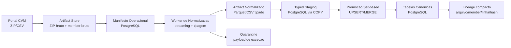
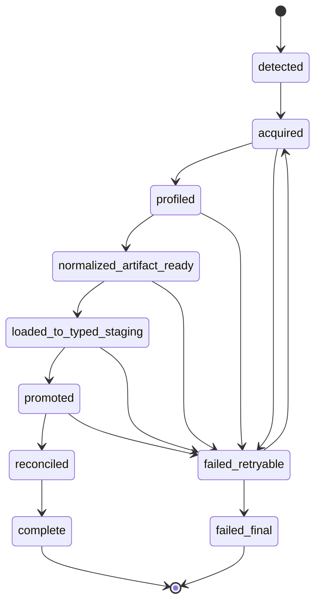
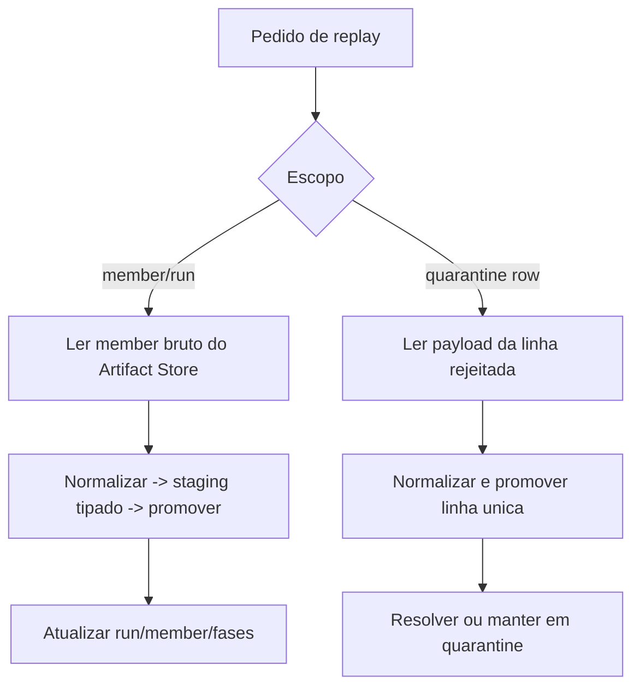
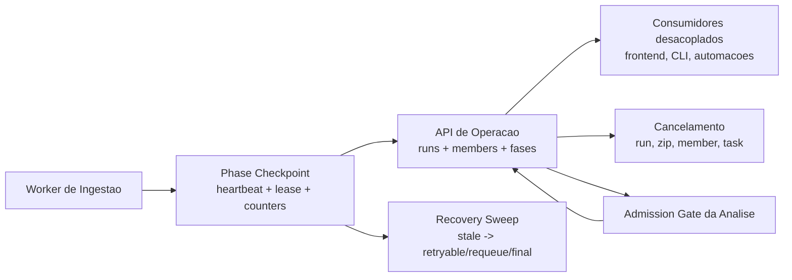

# PRD de Ingestao: Arquitetura Hibrida File + PostgreSQL

## 1. Resumo executivo

O pipeline atual ja usa `COPY` no stage PostgreSQL e ja possui partes da promocao em lote, mas continua caro demais em CPU, memoria e WAL porque:

- persiste o caminho feliz em `ingestion_rows` com colunas JSON e metadados por linha;
- re-le essas linhas via ORM para normalizacao, deduplicacao, resolucao de identidade e promocao;
- executa ciclos longos demais em uma unica task Celery (`extract -> stage -> promote -> reconcile -> finalize`);
- mantem payload bruto de member no banco relacional como estrategia padrao de replay e self-healing.

O resultado observado em ambiente real foi:

- `SIGKILL`/OOM do worker durante members volumosos;
- execucoes `em_execucao` presas em `stage` com centenas de milhares de linhas `pending`;
- alto custo de escrita e releitura em `ingestion_rows`;
- baixa previsibilidade de throughput por source/member.

Este PRD define uma arquitetura alvo que preserva PostgreSQL como base canonica de dominio e metadados operacionais, mas retira do PostgreSQL o papel de armazenamento principal de artefato bruto e de staging detalhado do caminho feliz.

## 2. Problema atual no codigo

### 2.1 O que o codigo atual ja faz bem

- Usa `COPY` para stage em PostgreSQL quando o bind e PostgreSQL (`app/services/ingestion/staging.py`).
- Faz leitura streaming do CSV em disco para montar chunks de stage.
- Possui algumas operacoes set-based na promocao financeira (`INSERT ... ON CONFLICT DO NOTHING`, `bulk_update_mappings`, batches para historico).
- Isola tarefas de ingestao e materializacao em filas distintas.
- Preserva lineage forte e replay operacional.

### 2.2 Onde o custo continua alto

- `ingestion_rows` persiste `raw_data`, `normalized_data`, `natural_key` e `validation_details` em JSON para o fluxo operacional, e nao apenas para excecoes.
- Cada linha recebe UUID, hash e metadados no Python antes do `COPY`.
- A promocao continua dirigida por loops Python/ORM sobre `IngestionRow`, com normalizacao, deduplicacao, resolucao de companhia e escrita de estado por linha.
- O replay de member depende de payload bruto persistido no banco.
- O worker segura memoria de fase demais por task, e o estado operacional fica orfao quando o processo morre.

### 2.3 Conclusao do diagnostico

O gargalo nao e "falta de `COPY`". O gargalo e usar PostgreSQL como:

1. base canonica;
2. raw artifact store;
3. staging row-by-row detalhado;
4. state store de replay do caminho feliz.

## 3. Objetivos

- Reduzir memoria de worker por member.
- Reduzir escrita e releitura de JSON em PostgreSQL.
- Reduzir WAL, churn de indices e contencao no banco.
- Tornar cada fase reiniciavel e observavel.
- Preservar lineage, replay, quarantine, idempotencia e reconcile.
- Permitir rebuild completo da base canonica a partir dos artefatos.
- Expor sinais operacionais suficientes na API para qualquer consumidor desacoplado entender estado, progresso, bloqueios, cancelamento e recuperacao sem depender de logs de worker.

## 4. Nao objetivos

- Nao substituir PostgreSQL como base canonica de dominio.
- Nao migrar o dominio financeiro para NoSQL.
- Nao exigir S3/MinIO na primeira entrega.
- Nao remover `quarantine` nem replay individual de linha.
- Nao exigir DuckDB como motor transacional ou runtime obrigatorio da primeira entrega.

## 5. Decisao arquitetural

### 5.1 Base canonica

PostgreSQL continua canonico para:

- tabelas de dominio;
- identidade e relacionamentos;
- `ExecucaoSincronizacao`, `IngestionRun` e demais metadados operacionais;
- `quarantine_items` e tentativas de replay;
- lineage compacto de registros promovidos;
- materializacao analitica e APIs.

### 5.2 Artifact Store

O artifact store passa a ser a fonte principal para:

- ZIP bruto baixado;
- CSV member bruto;
- artefato normalizado por member/run;
- manifestos de arquivos associados ao processamento.

Na primeira entrega, o artifact store deve ser filesystem local em `STORAGE_DIR`, com um layout compativel com futura troca para S3/MinIO sem reescrever o dominio.

### 5.3 Staging tipado

O caminho feliz deixa de usar `ingestion_rows` como staging detalhado principal.

O novo fluxo deve:

- normalizar o member para um artifact tipado;
- carregar esse artifact para tabelas staging tipadas em PostgreSQL via `COPY`;
- promover das tabelas staging para dominio de forma set-based.

As tabelas staging devem ser rebuildable. O default arquitetural e:

- `UNLOGGED` quando a tabela for apenas staging de fase e puder ser reconstruida do artifact;
- tabela comum quando a semantica exigir persistencia atraves de restart do banco.

### 5.4 Papel de `ingestion_rows`

`ingestion_rows` deixa de ser obrigatorio para linhas bem-sucedidas no caminho normal.

Seu papel futuro passa a ser um destes:

- staging fallback temporario para fontes ainda nao migradas;
- persistencia de excecoes/quarantine com payload detalhado;
- debug operacional controlado por feature flag ou retention curta.

### 5.5 Replay

- Replay de member/run deve ler o member bruto do artifact store.
- Replay de linha deve usar o payload da linha rejeitada, sem depender de staging historico inteiro.
- `IngestionFileMemberPayload` deixa de ser estrategia padrao. Pode existir apenas como compatibilidade temporaria durante a migracao.

### 5.6 DuckDB, Parquet e CSV tipado

Parquet e DuckDB nao substituem PostgreSQL no dominio canonico. O papel correto e operacional:

- Parquet e um bom formato alvo para artifacts normalizados quando o custo de dependencia (`pyarrow` ou DuckDB) for aceitavel e os benchmarks mostrarem ganho real de I/O, compressao e replay.
- CSV tipado continua aceitavel como formato inicial de artifact normalizado quando a prioridade for reduzir risco de dependencia e acelerar a migracao para staging tipado.
- DuckDB pode ser usado como ferramenta local de profiling/conversao/validacao de artifact, especialmente para ler CSV e escrever Parquet, mas nao deve virar coordenador de estado, fila, lock, identidade ou dominio.
- A primeira onda deve implementar a abstracao `NormalizedArtifactWriter` com pelo menos um backend simples (`typed_csv`) e contrato preparado para `parquet`.
- A decisao final de ativar `parquet` por default deve ser tomada por benchmark por source/member, medindo pico de memoria, tempo de normalizacao, tamanho em disco, tempo de `COPY` para PostgreSQL e facilidade de replay.

## 6. Fases operacionais alvo

Cada member/run deve ter fases explicitas e restartable:

1. `acquire`
2. `profile`
3. `normalize_artifact`
4. `load_typed_staging`
5. `promote`
6. `reconcile`
7. `complete`

Cada fase deve registrar:

- inicio, fim e ultima atividade;
- contadores de linhas relevantes;
- identificador do artifact de entrada e saida;
- erro estruturado e classificacao (`retryable`, `final`);
- owner da task/lease para recuperacao de orfandade.

### 6.1 Status canonico de fase

Cada fase deve usar um conjunto fechado de status para evitar interpretacao ambigua pela API:

- `pending`: fase ainda nao iniciada.
- `running`: fase em execucao e com lease ativo.
- `succeeded`: fase concluida.
- `skipped`: fase pulada por decisao explicita, como member reaproveitado por hash.
- `cancel_requested`: cancelamento solicitado, mas worker ainda nao confirmou parada.
- `cancelled`: fase ou escopo encerrado por cancelamento administrativo.
- `failed_retryable`: falha recuperavel; pode ser reenfileirada sem intervencao manual destrutiva.
- `failed_final`: falha final; exige correcao de dados, codigo, regra ou operacao manual.
- `stale`: lease/heartbeat expirou antes do encerramento; recovery sweep deve decidir requeue ou falha.

### 6.2 Sinal operacional agregado

`ExecucaoSincronizacao` e `IngestionRun` continuam sendo fontes primarias, mas a API deve expor um sinal agregado estavel para consumidores:

- `state`: estado operacional fechado (`queued`, `running`, `waiting`, `succeeded`, `succeeded_with_warnings`, `skipped`, `failed`, `cancel_requested`, `cancelled`, `stale`, `recovering`).
- `phase`: fase atual agregada.
- `progress`: contadores de members, linhas, bytes, fases concluidas e estimativa simples quando houver denominador confiavel.
- `liveness`: `heartbeat_at`, `lease_owner`, idade do heartbeat, flag `is_stale` e threshold usado.
- `blocking`: motivo pelo qual a execucao esta esperando (`none`, `manual_pause`, `materialization_gate`, `dependency`, `retry_backoff`, `worker_capacity`).
- `cancellation`: estado de cancelamento, solicitante, motivo, escopo e timestamp.
- `last_error`: erro estruturado mais recente, com tipo, fase, member, retryability e mensagem curta.
- `links`: IDs de `execucao_sincronizacao`, `ingestion_run`, member, artifacts e endpoints relacionados.

## 7. Modelo de dados alvo

### 7.1 Tabelas novas ou redefinidas

- `source_artifact_snapshots`: manter como manifesto de artefato remoto e local.
- `source_member_snapshots`: ampliar para apontar artifact bruto e artifact normalizado.
- `ingestion_phase_executions` ou equivalente:
  - `run_id`
  - `member_execution_id`
  - `scope_type` (`run`, `zip`, `member`, `quarantine_row`)
  - `scope_id`
  - `phase`
  - `status`
  - `attempt`
  - `lease_owner`
  - `task_id`
  - `started_at`
  - `heartbeat_at`
  - `finished_at`
  - `cancel_requested_at`
  - `cancelled_at`
  - `cancel_reason`
  - `error_type`
  - `error_message`
  - `error_retryable`
  - `input_artifact_uri`
  - `output_artifact_uri`
  - `metrics`
- `ingestion_cancellation_requests` ou equivalente:
  - `id`
  - `scope_type`
  - `scope_id`
  - `requested_by`
  - `reason`
  - `terminate_immediately`
  - `status` (`requested`, `propagated`, `acknowledged`, `completed`, `failed`)
  - `created_at`
  - `propagated_at`
  - `completed_at`
  - `affected_task_ids`
  - `affected_execution_ids`

### 7.2 Lineage em dominio

Os registros promovidos devem continuar carregando lineage suficiente para auditoria:

- `arquivo_origem`
- `ano_origem`
- `linha_origem`
- `hash_origem`
- `artifact/member/run identifiers` quando fizer sentido

O objetivo e manter rastreabilidade sem exigir a persistencia duravel de todas as linhas bem-sucedidas em `ingestion_rows`.

## 8. Fluxo operacional detalhado

### 8.1 Aquisição

- Fazer remote probe e decisao de download.
- Baixar ZIP bruto quando necessario.
- Registrar manifesto do ZIP bruto com hash, tamanho, ETag, Last-Modified, URL e storage URI.
- Extrair members em disco/artifact store sem persistir cada payload no banco como regra geral.

### 8.2 Profiling

- Detectar encoding, delimiter, row count e schema/header.
- Registrar metadata do member antes de qualquer promocao.
- Falha de schema para member inteiro deve encerrar a fase sem precisar criar `ingestion_rows` do caminho feliz.

### 8.3 Normalização para artifact

- Ler CSV member em streaming.
- Produzir artifact tipado por source/member/run.
- Esse artifact deve conter apenas colunas necessarias para a promocao e reconcile, nao toda a parafernalia operacional de `ingestion_rows`.
- Linhas invalidas devem ser desviadas para uma trilha de excecao com payload suficiente para quarantine/replay.

### 8.4 Load para staging tipado

- Carregar artifact tipado em tabela staging tipada via `COPY`.
- O stage deve ser particionado logicamente por run/member.
- Nao carregar JSON livre por linha para o caminho feliz.

### 8.5 Promoção set-based

- Usar `INSERT ... SELECT`, `ON CONFLICT`, `UPDATE ... FROM`, anti-join e batches SQL por entidade.
- Manter fallback linha-a-linha somente para excecoes estruturais ou rotas de quarantine.
- Resolver identidade antes da promocao final sempre que possivel, em estrutura vetorizada/set-based.

### 8.6 Reconcile

- Reconcile deve operar sobre staging tipado e hashes/keys, nao sobre releitura ORM de `ingestion_rows`.
- O output do reconcile precisa continuar explicito no estado operacional.

### 8.7 Finalização

- Promocao concluida atualiza `ExecucaoSincronizacao`, `IngestionRun` e `source_member_snapshots`.
- Limpeza de staging rebuildable pode ser imediata ou por retention curta.
- Artifacts brutos e normalizados seguem retention politica explicita.

### 8.8 Cancelamento

O cancelamento deve continuar existindo para escopos gerais e individuais:

- cancelamento de execucao geral ZIP: marca pai e filhos ainda nao finais como `cancel_requested`, revoga tasks conhecidas e impede despacho de novos members;
- cancelamento de execucao de member/CSV: marca apenas o member/run alvo, preservando pai e siblings ja concluidos;
- cancelamento por `id_tarefa`: continua aceito para tasks ainda nao materializadas em banco;
- cancelamento de replay/quarantine: encerra somente o escopo de replay, sem apagar o item de quarentena.

O worker deve consultar o pedido de cancelamento em fronteiras de chunk e antes de iniciar fases caras. Se receber `SIGTERM`, o estado persistido deve permitir distinguir:

- cancelado por operador;
- morto por OOM/SIGKILL;
- stale por perda de heartbeat;
- falha funcional do pipeline.

## 9. Fontes e ordem de migracao

### 9.1 Primeira onda

Migrar primeiro `dfp` e `itr`, porque:

- concentram volume alto;
- compartilham o caminho financeiro;
- sao a principal superficie observada de OOM;
- ja possuem promocao parcialmente set-based.

### 9.2 Segunda onda

- `fre`
- `fca`

### 9.3 Terceira onda

- `ipe`
- `vlmo`
- `cgvn`

### 9.4 Cadastro

`cadastro` pode permanecer em caminho proprio por mais tempo, porque o perfil e diferente e o volume e menor.

## 10. Observabilidade e recuperacao

### 10.1 Contratos de API alvo

A API deve ser a fonte primaria de operacao. Logs de worker sao diagnostico complementar, nao contrato de produto.

Endpoints atuais a preservar e expandir:

- `GET /ingestion/sincronizacoes`: lista execucoes administrativas, com filtros por status, fonte, ano, tipo, pai/filho e estado operacional agregado.
- `GET /ingestion/sincronizacoes/{id_execucao}`: detalhe de execucao, filhos, fases, cancelamento, ultimo erro e links para run/artifacts/quarantine.
- `POST /ingestion/sincronizacoes/cancelar`: cancelamento por `id_execucao` ou `id_tarefa`, mantendo suporte a ZIP geral e CSV individual.
- `GET /ingestion/runs`: lista tecnica de runs com `state`, `phase`, `progress`, `liveness`, `blocking`, `cancellation`, `quality_summary` e snapshots.
- `GET /ingestion/runs/{run_id}`: detalhe tecnico completo da run.
- `GET /ingestion/dashboard`: resumo operacional para backoffice.
- `GET /ingestion/quarentena` e `GET /ingestion/quarentena/resumo`: continuam sendo a superficie de excecoes reparaveis.

Endpoints novos recomendados:

- `GET /ingestion/runs/{run_id}/phases`: timeline de fases por run/member, com status, tentativas, heartbeat, artifacts e erro.
- `GET /ingestion/runs/{run_id}/members`: inventario paginado de members, status, progresso, artifacts, quarantine e decisao de reuse/reprocess.
- `GET /ingestion/operations`: visao consolidada para consumidores desacoplados, juntando execucoes, runs, filas, liveness, cancelamentos e gates.
- `POST /ingestion/runs/{run_id}/cancel`: cancelamento direto por run.
- `POST /ingestion/runs/{run_id}/members/{member_id}/cancel`: cancelamento direto de CSV/member.
- `POST /ingestion/runs/{run_id}/recover`: recuperacao administrativa controlada de fases `stale` ou `failed_retryable`.

### 10.2 Campos obrigatorios nas respostas operacionais

Toda resposta de detalhe de execucao/run deve conseguir responder, sem consultar logs:

- qual fonte, ano, arquivo e member estao em processamento;
- em qual fase esta;
- se ainda esta vivo;
- se esta parado por gate, backoff, dependencia ou falta de worker;
- quantas linhas/bytes/members foram lidos, normalizados, carregados, promovidos, rejeitados e reconciliados;
- se houve reuse por hash e de onde veio;
- quais artifacts foram produzidos;
- se ha pedido de cancelamento pendente ou confirmado;
- qual erro mais recente ocorreu, em qual fase e se e recuperavel;
- qual proxima acao recomendada para consumidor humano ou automatizado (`wait`, `cancel`, `recover`, `replay`, `inspect_quarantine`, `rerun_with_force`).

### 10.3 Metricas novas

- linhas por fase
- bytes por artifact
- tempo por fase
- retries por fase
- orphan recoveries
- stage -> promote lag
- quarantine por source/member/reason
- artifact rebuild count
- cancel requests por status/scope
- stale phase count por fonte/fase
- worker heartbeat lag por fila

### 10.4 Recuperacao de orfandade

Se um worker morrer:

- a fase em curso deve ser detectada como stale por `heartbeat_at`/lease;
- a execucao deve migrar para `failed_retryable` ou ser reenfileirada;
- o sistema nao deve deixar `run/member` indefinidamente em `em_execucao`.

### 10.5 Independencia de filas

Ingestao e materializacao devem continuar em filas separadas:

- ingestao: filas dedicadas `ingestion` e `ingestion_control`, consumidas apenas por workers de ingestao;
- materializacao: fila `analise_materializacao`, consumida apenas por workers de materializacao;
- recovery/maintenance de ingestao: fila `ingestion_control`, sem depender de workers de materializacao.

Remover workers de materializacao nao pode impedir progresso de ingestao. Remover workers de ingestao nao pode fazer materializacao iniciar quando o admission gate estiver vermelho por ingestao ativa ou pausa manual.

## 11. Compatibilidade e migracao

- A base atual pode ser purgada.
- A migracao preferencial e limpa, nao incremental e retrocompatibilizante ao extremo.
- O backend pode manter rotas operacionais similares, mas o modelo interno pode mudar livremente.
- `IngestionFileMemberPayload` e `ingestion_rows` entram em trilha de despriorizacao.

## 12. Critérios de aceite

1. Ingestao de members volumosos de `dfp`/`itr` nao depende de manter todas as linhas bem-sucedidas em `ingestion_rows`.
2. Um worker `SIGKILL` durante `load_typed_staging` ou `promote` nao deixa a execucao indefinidamente em `em_execucao`.
3. Replay de member/run funciona a partir do artifact bruto, sem redownload da CVM.
4. Replay de linha rejeitada funciona a partir do payload persistido da excecao.
5. Lineage de tabelas canônicas continua permitindo navegar do dado promovido ao `arquivo_origem` e `linha_origem`.
6. `COPY` permanece sendo usado no caminho PostgreSQL, agora sobre staging tipado.
7. A API informa estado, fase, progresso, liveness, bloqueio, cancelamento e erro estruturado para run, ZIP e member.
8. Cancelamento de ZIP, member/CSV e task continua funcionando e fica visivel no estado operacional.
9. Um consumidor desacoplado consegue decidir entre aguardar, cancelar, recuperar, reprocessar ou inspecionar quarentena sem ler logs.

## 13. Decisões explicitamente rejeitadas

- NoSQL como write model canonico de dominio.
- Remocao de lineage em nome de throughput.
- Dependencia imediata de S3/MinIO para iniciar a migracao.
- Manter PostgreSQL como raw artifact store principal para o caminho feliz.

## 14. Plano de implementacao

### 14.1 Marco 0 - Contratos e modelo operacional

Objetivo: criar a base observavel antes de trocar o motor de ingestao.

Entregas:

- Definir enums fechados de `phase_status`, `operational_state`, `blocking_reason`, `cancellation_status` e `next_action`.
- Criar migration para `ingestion_phase_executions` e, se necessario, `ingestion_cancellation_requests`.
- Adicionar helpers de lifecycle para iniciar fase, heartbeat, finalizar fase, falhar fase, solicitar cancelamento e marcar stale.
- Atualizar schemas de API para expor `state`, `progress`, `liveness`, `blocking`, `cancellation`, `last_error`, `next_action` e `links`.
- Atualizar OpenAPI, Docusaurus e `docs/frontend_api_changelog.md` quando os contratos forem implementados.

Testes:

- modelos inserem/atualizam fase em SQLite e PostgreSQL;
- schema rejeita estados desconhecidos quando aplicavel;
- listagem/detalhe de run mostram fase atual e liveness;
- cancelamento por pai propaga para filhos nao finais;
- cancelamento por member nao cancela siblings;
- fase stale aparece como recuperavel.

### 14.2 Marco 1 - Artifact store local

Objetivo: retirar payload bruto do banco como caminho feliz, mantendo replay.

Entregas:

- Criar interface `ArtifactStore` com operacoes `put_bytes`, `put_stream`, `open_read`, `exists`, `stat`, `delete`, `uri_for`.
- Implementar backend local em `STORAGE_DIR`, com layout deterministico por fonte/ano/run/member/hash.
- Registrar URI, hash, tamanho, content type e papel do artifact em manifesto operacional.
- Passar aquisicao ZIP e extracao de members a gravar artifacts brutos no filesystem.
- Manter `IngestionFileMemberPayload` apenas como fallback temporario controlado por feature flag.

Testes:

- artifacts sao gravados com hash esperado;
- replay de member le artifact bruto sem redownload;
- arquivo ausente gera erro estruturado `artifact_missing`;
- nomes de members preservam case original no path logico e nos metadados.

### 14.3 Marco 2 - Normalized artifacts

Objetivo: normalizar uma vez, promover muitas vezes, sem `ingestion_rows` para caminho feliz.

Entregas:

- Criar `NormalizedArtifactWriter` com backend inicial `typed_csv`.
- Preparar contrato para backend `parquet` sem obrigar dependencia na primeira entrega.
- Definir schema tipado por family/source, com colunas de dominio, chaves naturais, lineage e hash.
- Direcionar linhas invalidas para quarantine payload, nao para artifact feliz.
- Registrar artifact normalizado no checkpoint da fase `normalize_artifact`.
- Adicionar script de benchmark que compare `typed_csv` e `parquet` quando dependencias estiverem habilitadas.

Testes:

- normalizacao de DFP/ITR gera artifact com colunas esperadas;
- linha invalida vira quarantine e nao entra no artifact feliz;
- artifact pode ser reconstruido a partir do member bruto;
- benchmark reporta tempo, memoria aproximada, tamanho e throughput.

### 14.4 Marco 3 - Typed staging PostgreSQL

Objetivo: carregar artifacts normalizados por `COPY` para tabelas staging tipadas.

Entregas:

- Criar tabelas staging tipadas para DFP/ITR financeiro, preferencialmente `UNLOGGED` quando rebuildable.
- Criar loader por dialect: PostgreSQL usa `COPY`; SQLite usa fallback de teste.
- Particionar logicamente staging por `run_id`/`member_id`.
- Registrar progresso de `load_typed_staging` em contadores de linhas/bytes.
- Limpar staging por retention ou ao final da run, sem quebrar replay.

Testes:

- loader usa caminho PostgreSQL em teste de integracao quando disponivel;
- fallback SQLite preserva semantica;
- restart apos staging consegue limpar/reconstruir pelo artifact;
- `COPY` falho marca fase como `failed_retryable` ou `failed_final` conforme erro.

### 14.5 Marco 4 - Promocao set-based DFP/ITR

Objetivo: remover loops ORM sobre `IngestionRow` do caminho financeiro volumoso.

Entregas:

- Implementar resolucao de identidade em lote para headers/documentos financeiros.
- Promover documentos financeiros via `INSERT ... SELECT`/`ON CONFLICT`/`UPDATE ... FROM`.
- Promover demonstracoes financeiras via staging tipado, preservando `arquivo_origem`, `linha_origem`, `hash_origem`, `id_documento` e `versao`.
- Manter fallback linha-a-linha apenas para excecoes/quarantine.
- Reconcile por anti-join contra staging tipado.

Testes:

- DFP e ITR promovem volume representativo com contadores corretos;
- conflito de chave atualiza ou ignora conforme regra atual;
- reconcile remove obsoletos somente no escopo correto;
- lineage permite mapear API -> registro -> member/linha;
- falha em subconjunto gera quarantine sem abortar todo o member quando possivel.

### 14.6 Marco 5 - Recovery, cancelamento e API operacional

Objetivo: tornar o pipeline operavel por API mesmo em falhas duras.

Entregas:

- Worker atualiza heartbeat durante fases longas e em fronteiras de chunk.
- Recovery sweep detecta fases stale e aplica politica `requeue`, `failed_retryable` ou `failed_final`.
- Cancelamento consulta `ingestion_cancellation_requests` entre chunks e antes de fases caras.
- `GET /ingestion/runs/{run_id}/phases` e `GET /ingestion/runs/{run_id}/members` entram em producao.
- `GET /ingestion/operations` agrega filas, gates, execucoes ativas, stale e cancelamentos.
- Admission gate da analise passa a ler somente estados realmente bloqueadores (`running`, `cancel_requested` quando ainda ha trabalho ativo, e recovery ativo se estiver promovendo).

Testes:

- `SIGKILL` simulado por fase expirada nao deixa run infinita em `running`;
- cancelamento de ZIP impede novos members e preserva concluidos;
- cancelamento de member encerra apenas o CSV alvo;
- API mostra `next_action=recover` para stale recuperavel;
- materializacao nao inicia quando ingestao esta realmente ativa;
- materializacao nao bloqueia progresso de ingestao.

### 14.7 Marco 6 - Expandir fontes

Objetivo: migrar sem big bang desnecessario.

Ordem:

1. `dfp` e `itr`: financeiro volumoso e maior incidencia de OOM.
2. `fre` e `fca`: volume e complexidade intermediarios.
3. `ipe`, `vlmo`, `cgvn`: menor volume ou regras mais isoladas.
4. `cadastro`: manter separado ate haver ganho claro, porque o perfil operacional e diferente.

Para cada fonte:

- mapear schemas tipados;
- definir normalized artifact;
- implementar loader;
- implementar promote/reconcile set-based;
- validar replay/cancelamento/quarantine;
- atualizar docs e changelog se a API visivel mudar.

### 14.8 Marco 7 - Decisao final de Parquet

Objetivo: decidir por evidencia, nao por preferencia.

Criterios para ativar Parquet por default:

- menor pico de memoria ou sem regressao;
- artifact significativamente menor em disco para members volumosos;
- tempo total `normalize_artifact + load_typed_staging + promote` melhor que CSV tipado;
- dependencia operacional aceitavel no Docker;
- replay e debug continuam simples para operadores.

Se Parquet nao vencer o benchmark, manter CSV tipado como artifact normalizado default e deixar DuckDB/Parquet como ferramenta opcional de diagnostico/export.

## 15. Referências técnicas

- PostgreSQL bulk loading e `COPY`: https://www.postgresql.org/docs/current/populate.html
- PostgreSQL `COPY`: https://www.postgresql.org/docs/16/sql-copy.html
- PostgreSQL `UNLOGGED`: https://www.postgresql.org/docs/current/sql-createtable.html
- DuckDB `COPY` e arquivos analiticos: https://duckdb.org/docs/current/sql/statements/copy
- DuckDB Parquet: https://duckdb.org/docs/current/data/parquet/overview
- Apache Parquet: https://parquet.apache.org/docs/
- Celery optimization e comportamento de worker: https://docs.celeryq.dev/en/stable/userguide/optimizing.html
