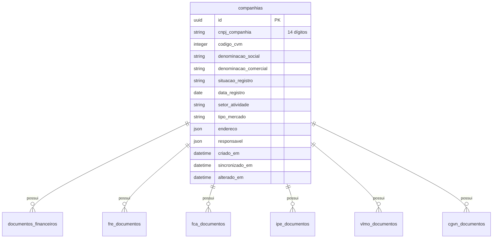
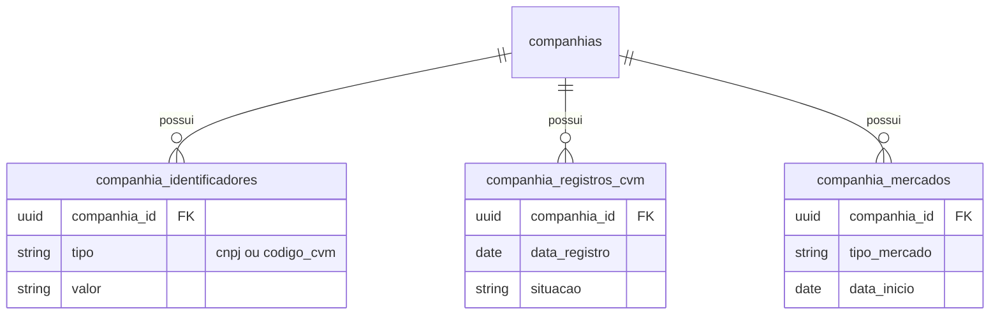

# Modelo de Dados

## Visão Geral

O modelo de dados do Tucano CVM é dividido em duas grandes categorias:

1. **Tabelas de Domínio**: Contêm os dados de negócio normalizados (companhias, demonstrações financeiras, FRE, etc.)
2. **Tabelas Operacionais**: Suportam o pipeline de ingestão (execuções, quarentena, snapshots, etc.)

## Tabelas de Domínio

### `companhias` (Entidade Raiz)

A tabela raiz do domínio. Todos os outros dados se vinculam a uma companhia sempre que possível.



**Campos de rastreabilidade:**
- `arquivo_origem`: CSV específico da CVM que originou o registro
- `ano_origem`: Lote anual processado
- `linha_origem`: Número da linha no CSV original
- `hash_origem`: Hash para idempotência
- `criado_em`: Momento de inserção interna
- `sincronizado_em`: Última vez que o registro foi reencontrado na fonte
- `alterado_em`: Última vez que houve mudança real de negócio

**Importante:** `sincronizado_em` ≠ `alterado_em`. Reapresentação regulatória não é igual a alteração econômica.

### Tabelas Financeiras (DFP/ITR)

#### `documentos_financeiros`

Cabeçalho documental de DFP e ITR.

| Campo | Tipo | Descrição |
|-------|------|-----------|
| `id` | UUID | Identificador interno |
| `tipo_formulario` | string | `DFP` ou `ITR` |
| `cnpj_companhia` | string | CNPJ com 14 dígitos |
| `codigo_cvm` | integer | Código CVM |
| `data_referencia` | date | Data de referência |
| `versao` | integer | Versão do formulário |
| `id_documento` | integer | ID do documento na CVM |
| `categoria_documento` | string | Categoria reportada |

#### `demonstracoes_financeiras`

Tabela mais importante para linhas contábeis.

| Campo | Tipo | Descrição |
|-------|------|-----------|
| `tipo_demonstracao` | string | BPA, BPP, DRE, DFC, DMPL, DRA, DVA |
| `escopo_demonstracao` | string | `consolidado` ou `individual` |
| `codigo_conta` | string | Código da conta contábil |
| `descricao_conta` | string | Descrição textual |
| `valor_conta` | numeric | **Valor ajustado pela escala** (valor real em R$) |
| `valor_conta_reportado` | numeric | Valor bruto como reportado pela CVM |
| `escala_moeda` | string | `UNIDADE`, `MIL` ou `MILHAO` |
| `fator_escala_moeda` | integer | Multiplicador (1, 1000, 1000000) |
| `ordem_exercicio` | string | `ÚLTIMO`, `PENULTIMO`, etc. |

**Fórmula:** `valor_conta = valor_conta_reportado × fator_escala_moeda`

**Exemplo:**
```json
{
  "codigo_conta": "3.03",
  "descricao_conta": "Receita Líquida",
  "valor_conta_reportado": 740500.0,
  "escala_moeda": "MIL",
  "fator_escala_moeda": 1000,
  "valor_conta": 740500000.0
}
```

#### `composicoes_capital`

Composição do capital social extraída de DFP/ITR.

| Campo | Tipo | Descrição |
|-------|------|-----------|
| `quantidade_acoes_ordinarias_capital_integralizado` | numeric | Ações ON no capital integralizado |
| `quantidade_acoes_preferenciais_capital_integralizado` | numeric | Ações PN no capital integralizado |
| `quantidade_total_acoes_capital_integralizado` | numeric | Total no capital integralizado |
| `quantidade_acoes_ordinarias_tesouraria` | numeric | Ações ON em tesouraria |
| `quantidade_acoes_preferenciais_tesouraria` | numeric | Ações PN em tesouraria |
| `quantidade_total_acoes_tesouraria` | numeric | Total em tesouraria |

#### `pareceres_financeiros`

Pareceres e declarações dos auditores.

| Campo | Tipo | Descrição |
|-------|------|-----------|
| `tipo_relatorio_auditor` | string | Tipo de relatório |
| `tipo_parecer_declaracao` | string | Tipo de parecer |
| `texto_parecer_declaracao` | text | Conteúdo textual completo |

### Tabelas FRE (Formulário de Referência)

O FRE possui **48 datasets**, dos quais **9 são promovidos** para tabelas de domínio:

| Tabela | Descrição |
|--------|-----------|
| `fre_documentos` | Cabeçalho documental |
| `fre_auditores` | Informações de auditoria |
| `fre_capital_social` | Capital social declarado |
| `fre_posicoes_acionarias` | Posição acionária detalhada |
| `fre_remuneracoes_totais_orgaos` | Remuneração por órgão |
| `fre_empregados_posicao_genero` | Empregados por gênero |
| `fre_responsaveis` | Responsáveis pelo FRE |
| `fre_participacoes_sociedades` | Participações em outras sociedades |
| `fre_relacoes_familiares` | Relações familiares entre administradores |

**Exemplo de consulta:**
```bash
GET /fre/posicao-acionaria?codigo_cvm=25224&data_referencia_inicio=2024-01-01
```

### Tabelas FCA (Formulário Cadastral)

| Tabela | Descrição |
|--------|-----------|
| `fca_documentos` | Cabeçalho documental |
| `fca_geral` | Dados gerais da companhia |
| `fca_enderecos` | Endereços |
| `fca_dri` | Diretor de Relações com Investidores |
| `fca_auditores` | Auditores independentes |
| `fca_valores_mobiliarios` | Valores mobiliários emitidos |

### Tabelas IPE (Informações Periódicas e Eventuais)

| Tabela | Descrição |
|--------|-----------|
| `ipe_documentos` | Metadados de documentos (Fatos Relevantes, Avisos, etc.) |

**Campos importantes:**
- `categoria`: Fato Relevante, Aviso aos Acionistas, Estatuto Social, etc.
- `assunto`: Descrição do assunto
- `data_entrega`: Data de entrega à CVM
- `link_download`: URL para download do documento original

### Tabelas VLMO (Valores Mobiliários)

| Tabela | Descrição |
|--------|-----------|
| `vlmo_documentos` | Cabeçalho documental |
| `vlmo_consolidado` | Negociações e posições de insiders |

**Campos do consolidado:**
- `tipo_empresa`: Controladora, Controlada, Coligada, etc.
- `tipo_cargo`: Diretor, Conselheiro, etc.
- `tipo_movimentacao`: Compra, Venda, Doação, etc.
- `tipo_ativo`: Ação, Opção, Debênture, etc.
- `quantidade`, `preco_unitario`, `volume`

### Tabelas CGVN (Governança Corporativa)

| Tabela | Descrição |
|--------|-----------|
| `cgvn_documentos` | Cabeçalho documental |
| `cgvn_praticas` | Práticas de governança adotadas |

**Campos das práticas:**
- `id_item`: Identificador da prática (ex: `1.1.1`)
- `pratica_recomendada`: Texto da prática recomendada
- `pratica_adotada`: `Sim`, `Não`, `Parcialmente`, `Não se Aplica`
- `explicacao`: Justificativa quando não adotada

## Tabelas Operacionais (Pipeline)

### `execucoes_sincronizacao`

Registra cada execução de ingestão.

| Campo | Tipo | Descrição |
|-------|------|-----------|
| `id` | UUID | Identificador da execução |
| `id_tarefa` | string | ID da task no Celery |
| `tipo_fonte` | string | `cadastro`, `dfp`, `itr`, etc. |
| `ano` | integer | Ano de referência |
| `arquivo` | string | Nome do arquivo processado |
| `hash_arquivo` | string | SHA-256 do arquivo |
| `status` | string | Status atual |
| `iniciada_em` | datetime | Início da execução |
| `finalizada_em` | datetime | Fim da execução |
| `total_linhas_lidas` | integer | Total de linhas processadas |
| `total_inseridos` | integer | Registros inseridos |
| `total_atualizados` | integer | Registros atualizados |
| `total_inalterados` | integer | Registros sem alteração |
| `total_rejeitados` | integer | Enviados para quarentena |

### `ingestion_runs`

Representa uma execução do pipeline com metadados ricos.

| Campo | Tipo | Descrição |
|-------|------|-----------|
| `remote_probe` | JSON | Resultado da sondagem remota |
| `change_summary` | JSON | Mudanças estruturais detectadas |
| `quality_summary` | JSON | Resumo de qualidade |
| `artifact_snapshot` | JSON | Snapshot do artefato CVM |
| `member_snapshot_summary` | JSON | Inventário de membros |
| `delivery_snapshot_summary` | JSON | Índice documental capturado |
| `reconcile_summary` | JSON | Remoções aplicadas |

### `ingestion_rows` (Staging Temporário)

**Importante:** Esta tabela é temporária. Linhas bem-sucedidas são removidas após a promoção.

| Campo | Tipo | Descrição |
|-------|------|-----------|
| `raw_data` | JSON | Dados brutos da linha |
| `raw_hash` | string | Hash dos dados brutos |
| `row_kind` | string | Tipo de linha (ex: `dfp_documento`) |
| `natural_key` | JSON | Chave natural para deduplicação |
| `validation_status` | string | Status da validação |
| `resolved_companhia_id` | UUID | Companhia resolvida |

### `quarantine_items`

Linhas rejeitadas por erro real.

| Campo | Tipo | Descrição |
|-------|------|-----------|
| `motivo_codigo` | string | Código do erro |
| `severidade` | string | `error` ou `warning` |
| `reparavel` | boolean | Pode ser reparado automaticamente? |
| `tentativas_reprocessamento` | integer | Tentativas de replay |
| `diagnostico` | JSON | Detalhes do erro |

### Tabelas de Snapshot (Lifecycle)

| Tabela | Descrição |
|--------|-----------|
| `source_artifact_snapshots` | Snapshot do artefato CVM (ZIP/CSV) |
| `source_member_snapshots` | Snapshot de cada membro CSV |
| `source_delivery_snapshots` | Índice documental extraído |
| `ingestion_file_member_payloads` | Payload bruto do membro (self-heal) |
| `ingestion_reconcile_hashes` | Hashes para reconcile set-based |

## Relacionamentos



## Índices e Performance

### Índices Principais

```sql
-- Companhias
CREATE INDEX idx_companhias_cnpj ON companhias(cnpj_companhia);
CREATE INDEX idx_companhias_codigo_cvm ON companhias(codigo_cvm);
CREATE INDEX idx_companhias_situacao ON companhias(situacao_registro);

-- Demonstrações financeiras
CREATE INDEX idx_demonstracoes_companhia_data 
  ON demonstracoes_financeiras(cnpj_companhia, data_referencia);
CREATE INDEX idx_demonstracoes_tipo_conta 
  ON demonstracoes_financeiras(tipo_demonstracao, codigo_conta);

-- Execuções
CREATE INDEX idx_execucoes_tipo_ano 
  ON execucoes_sincronizacao(tipo_fonte, ano);
CREATE INDEX idx_execucoes_status 
  ON execucoes_sincronizacao(status);
```

## Paginação

Todos os endpoints de listagem usam paginação uniforme:

```json
{
  "dados": [...],
  "paginacao": {
    "pagina": 1,
    "tamanho_pagina": 100,
    "total": 1250
  }
}
```

**Limites:**
- `tamanho_pagina` máximo: 500
- Exportações em lote: máximo 100.000 registros

## Próximos Passos

- [Resolução de Identidade](./identity-resolution.md) - Como o sistema resolve companhias
- [Quarentena e Replay](./quarantine-replay.md) - Como tratar erros
- [API Endpoints](../api-endpoints/companhias.md) - Consulte os dados