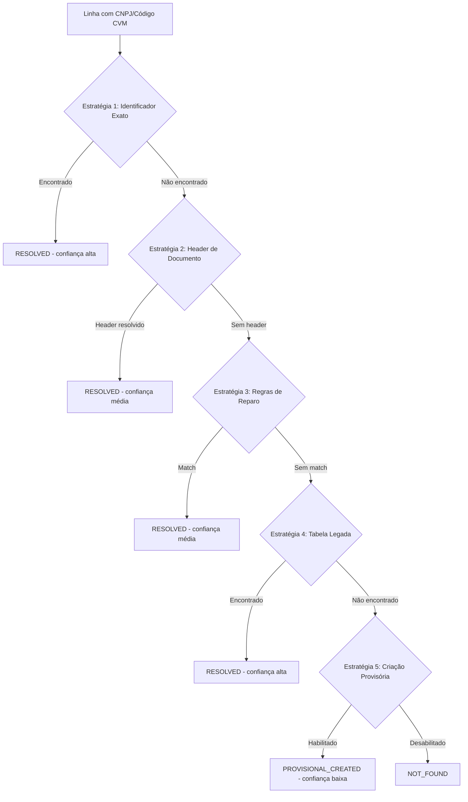
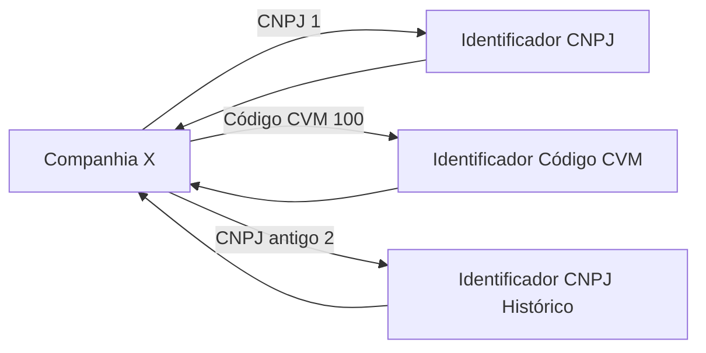
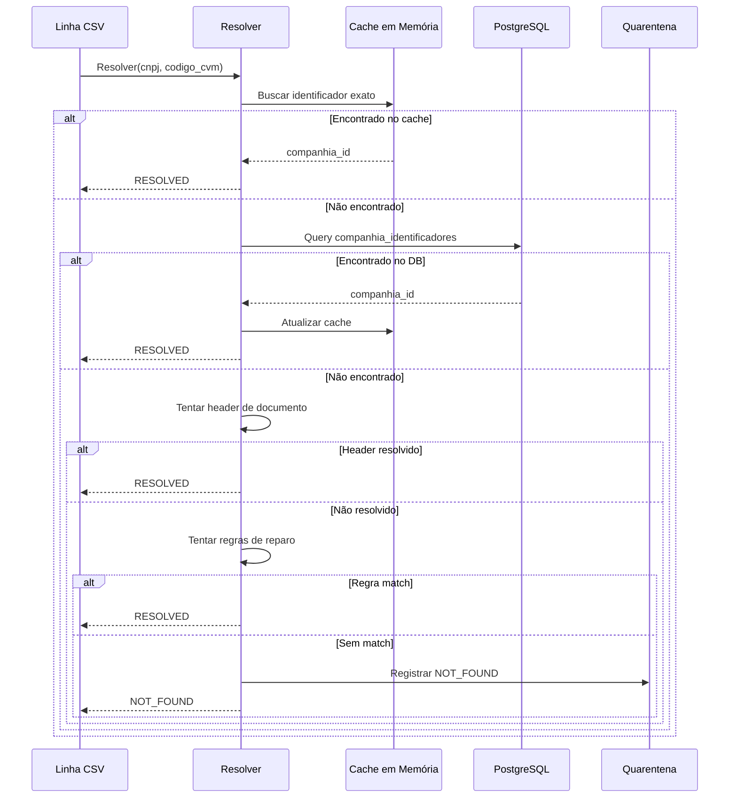

# Resolução de Identidade

## Visão Geral

A resolução de identidade é o processo de vincular cada linha de dados da CVM a uma companhia registrada na tabela `companhias`. Este é um dos desafios mais complexos do pipeline, pois os dados da CVM podem conter:

- CNPJs que não existem mais
- Códigos CVM desatualizados
- Inconsistências entre CNPJ e código CVM
- Companhias com múltiplas identificações históricas

## Estratégia em Cascata

O sistema utiliza **5 estratégias em ordem de precedência** para resolver a identidade:



## Estratégia 1: Identificador Exato

**Confiança:** Alta

Busca direta na tabela `companhia_identificadores`:

```python
# Pseudocódigo
def resolver_por_identificador_exato(cnpj, codigo_cvm):
    id_por_cnpj = db.query(CompanhiaIdentificador).filter(
        tipo="cnpj", valor=normalizar_cnpj(cnpj)
    ).first()
    
    id_por_codigo = db.query(CompanhiaIdentificador).filter(
        tipo="codigo_cvm", valor=codigo_cvm
    ).first()
    
    if id_por_cnpj and id_por_codigo:
        if id_por_cnpj.companhia_id == id_por_codigo.companhia_id:
            return Resultado.RESOLVED  # Ambos convergem
        else:
            return Resultado.AMBIGUOUS  # Conflito
    elif id_por_cnpj:
        return Resultado.RESOLVED
    elif id_por_codigo:
        return Resultado.RESOLVED
    else:
        return None  # Tentar próxima estratégia
```

**Cache:** Os identificadores são carregados em cache no início da sessão de processamento para performance.

## Estratégia 2: Header de Documento

**Confiança:** Média

Para linhas filhas (demonstrações, auditores, etc.), usa a companhia já resolvida do documento header.

**Como funciona:**
1. O documento header (ex: `dfp_cia_aberta_2025.csv`) é processado primeiro
2. Cada linha do header é resolvida e armazenada em `header_map`
3. Linhas dependentes (ex: `dfp_cia_aberta_BPA_con_2025.csv`) consultam o `header_map`

```python
# Chave do header_map
header_key = (tipo_formulario, id_documento, versao, data_referencia)

# Exemplo
header_map = {
    ("DFP", 123456, 1, "2024-12-31"): companhia_id_1,
    ("DFP", 123456, 2, "2024-12-31"): companhia_id_1,  # Reapresentação
}
```

**Vantagem:** Evita resolver a mesma companhia múltiplas vezes para cada linha da demonstração.

## Estratégia 3: Regras de Reparo (Repair Rules)

**Confiança:** Média

Regras manuais configuráveis para casos conhecidos.

**Exemplo de regra:**
```json
{
  "tipo": "identity_exact",
  "descricao": "CNPJ antigo da Empresa X",
  "match_fields": {
    "cnpj_antigo": "12345678000199"
  },
  "companhia_id": "uuid-da-companhia-correta"
}
```

**Uso típico:**
- Companhias que mudaram de CNPJ
- Erros conhecidos de digitação na CVM
- Fusões e cisões históricas

**Gerenciamento:**
```bash
# Listar regras
GET /ingestion/repair-rules

# Criar regra
POST /ingestion/repair-rules
{
  "tipo": "identity_exact",
  "match_fields": {"cnpj_antigo": "12345678000199"},
  "companhia_id": "uuid-aqui"
}
```

## Estratégia 4: Tabela Legada `Companhia`

**Confiança:** Alta

Busca na tabela principal `companhias` por CNPJ e/ou código CVM.

**Diferença da Estratégia 1:**
- Estratégia 1 usa tabela de índices (`companhia_identificadores`)
- Estratégia 4 usa tabela principal (mais lenta, mas mais completa)

## Estratégia 5: Criação Provisória

**Confiança:** Baixa

**Feature flag:** `INGESTION_PROVISIONAL_COMPANY_ENABLED` (padrão: `false`)

Quando habilitado, cria uma companhia provisória para permitir que o processamento continue:

```python
companhia_provisoria = Companhia(
    cnpj_companhia=gerar_cnpj_provisorio(codigo_cvm),
    codigo_cvm=codigo_cvm,
    denominacao_social=f"PROVISORIA - CVM {codigo_cvm}",
    tipo_emissor="provisorio",
    qualidade_identidade="baixa"
)
db.add(companhia_provisoria)
db.commit()
```

**Quando usar:**
- Ambientes de desenvolvimento/teste
- Backfill inicial quando o cadastro ainda não está completo

**Quando NÃO usar:**
- Produção (pode criar dados inconsistentes)

## Resultados da Resolução

| Status | Confiança | Descrição |
|--------|-----------|-----------|
| `RESOLVED` | Alta/Média | Companhia encontrada |
| `AMBIGUOUS` | - | CNPJ e código CVM apontam para companhias diferentes |
| `NOT_FOUND` | - | Nenhuma estratégia resolveu |
| `PROVISIONAL_CREATED` | Baixa | Companhia provisória criada |

## Grafo de Identidade

O sistema mantém um **grafo de identidade** em memória para resolução rápida:



**Operações:**
- `ensure_identity_graph_ready()`: Carrega o grafo no início da sessão
- `rebuild_identity_graph()`: Reconstrói após mudanças no cadastro

**Reconstrução manual:**
```bash
POST /ingestion/identity/rebuild
```

**Quando reconstruir:**
- Após sincronização do cadastro
- Após aplicar regras de reparo
- Quando houver muitas linhas em quarentena com `companhia_nao_encontrada`

## Fluxo Completo de Resolução



## Métricas de Resolução

O sistema rastreia métricas de resolução para monitoramento:

```python
observe_resolution(
    method="identificador_exato",  # ou "header", "repair_rule", etc.
    confidence="alta"  # ou "media", "baixa"
)
```

**Métrica Prometheus:**
```
cvm_ingestion_resolution_total{method="identificador_exato",confidence="alta"} 15234
cvm_ingestion_resolution_total{method="header",confidence="media"} 8921
cvm_ingestion_resolution_total{method="repair_rule",confidence="media"} 42
```

## Solucao de Problemas

### Muitas linhas com `companhia_nao_encontrada`

**Sintomas:**
- Quality gate falha (`falha_qualidade`)
- Muitos itens em quarentena com `motivo_codigo=companhia_nao_encontrada`

**Causas possíveis:**
1. Cadastro desatualizado
2. CNPJ/código CVM incorretos na fonte
3. Grafo de identidade não reconstruído

**Soluções:**
```bash
# 1. Sincronizar cadastro
POST /ingestion/sincronizacoes/cadastro

# 2. Reconstruir grafo de identidade
POST /ingestion/identity/rebuild

# 3. Ver quarentena
GET /ingestion/quarentena?motivo_codigo=companhia_nao_encontrada

# 4. Criar regra de reparo se necessário
POST /ingestion/repair-rules
{
  "tipo": "identity_exact",
  "match_fields": {"cnpj": "cnpj-problematico"},
  "companhia_id": "uuid-correto"
}

# 5. Replay da quarentena
POST /ingestion/replay/quarentena
{
  "reason_code": "companhia_nao_encontrada"
}
```

### Conflito `companhia_ambigua`

**Sintomas:**
- Linha em quarentena com `motivo_codigo=companhia_ambigua`
- CNPJ aponta para uma companhia, código CVM para outra

**Causa:**
- Dados inconsistentes na fonte CVM
- Fusão/cisão não refletida no cadastro

**Solução:**
1. Verificar qual identificador está correto
2. Atualizar cadastro manualmente se necessário
3. Criar regra de reparo para priorizar um identificador

## Próximos Passos

- [Quarentena e Replay](./quarantine-replay.md) - Como tratar erros de resolução
- [Pipeline de Ingestão](./ingestion-pipeline.md) - Entenda o fluxo completo
- [API Endpoints](../ingestion/overview.md) - Endpoints administrativos
