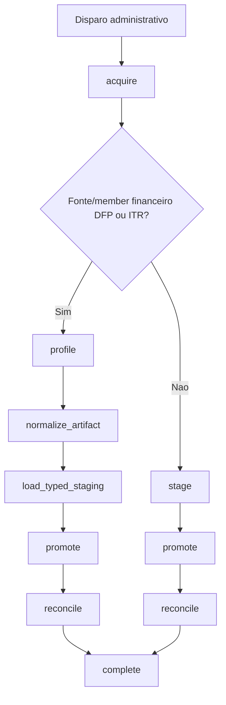
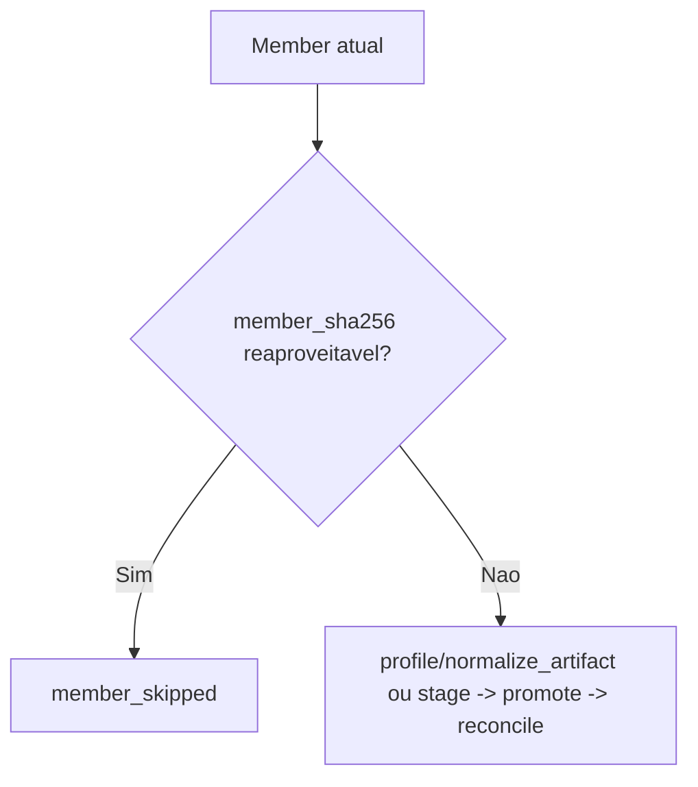

# Pipeline de Ingestao

## Visao tecnica

O pipeline de ingestao processa fontes publicas da CVM em dois niveis:

- nivel administrativo: `ExecucaoSincronizacao`
- nivel tecnico: `IngestionRun`

Para fontes anuais, o artefato principal e o ZIP. O trabalho real, porem, e decidido member a member.

## Fluxo atual



### `acquire`

- consulta metadados remotos;
- decide se o artefato precisa ser baixado;
- registra snapshot do artefato;
- prepara a run para o restante do fluxo.

### `profile`

Usada no direct path financeiro DFP/ITR.

- identifica header, encoding, delimiter, tamanho e quantidade de linhas;
- registra ou atualiza o member;
- valida o schema esperado para o `row_kind`;
- nao grava linhas validas em `ingestion_rows`.

### `normalize_artifact`

Usada no direct path financeiro DFP/ITR.

- le o CSV bruto do member em streaming;
- normaliza linhas validas;
- resolve companhia com caches carregados na sessao;
- grava artifact normalizado `typed_csv`;
- envia linhas rejeitadas para quarentena.

### `load_typed_staging`

Usada no direct path financeiro DFP/ITR.

- carrega o artifact normalizado para `ingestion_financeiro_stage_rows`;
- usa `COPY` streaming em PostgreSQL;
- registra contadores de linhas e bytes carregados.

### `stage`

- extrai e inventaria members;
- registra header, tamanho, encoding, delimiter e row count;
- aplica snapshots de lifecycle por member;
- produz artifacts normalizados quando o fluxo da fonte usa este caminho;
- carrega o staging operacional necessario ao promote.

### `promote`

- normaliza payloads;
- resolve companhia e relacionamentos;
- aplica deduplicacao e upsert;
- gera historico de alteracao quando ha mudanca de negocio;
- envia excecoes para quarentena.

### `reconcile`

- remove registros promovidos que ficaram obsoletos para o escopo reprocessado;
- atualiza counters operacionais da run.

## Direct path financeiro

DFP e ITR usam o direct path financeiro para members validos. O objetivo e manter PostgreSQL como base canonica sem duplicar milhoes de linhas validas em staging JSON.

Garantias operacionais:

- linhas validas nao sao persistidas em `ingestion_rows`;
- linhas rejeitadas ainda entram em quarentena com contexto minimo;
- artifacts normalizados preservam replay e auditoria;
- staging tipado e purgado ao final do member;
- o ZIP financeiro despacha members em janela ativa limitada por `INGESTION_MAX_ACTIVE_MEMBERS_PER_PARENT`, default `2`.

## Reuso por member

Para fontes anuais, a decisao de trabalho e feita por member:



Campos que explicam essa decisao:

- `quality_summary.members_reprocessed`
- `quality_summary.members_reused_from_previous`
- `quality_summary.members_reused_from_failed_parent`
- `member_snapshot_summary`
- `lifecycle_decision`

## Artifacts normalizados

O pipeline suporta artifact normalizado por member.

Formato atual:

- `typed_csv` por default para DFP/ITR
- `parquet` como opcional de benchmark

Decisao atual do projeto:

- manter `typed_csv` como default no ambiente Docker medido;
- usar `parquet` apenas quando benchmark por fonte/member justificar.

## Filas Celery

As filas operacionais sao isoladas:

- `ingestion`: processamento pesado de members;
- `ingestion_control`: coordenacao, finalizadores e recovery de ingestao;
- `analise_materializacao`: materializacao analitica.

Workers de materializacao nao devem consumir filas de ingestao. Novas publicacoes usam `ingestion` e `ingestion_control`; workers de ingestao podem manter a fila historica `celery` apenas para compatibilidade operacional e drenagem de mensagens antigas.

## Gate de materializacao

Todo disparo administrativo de ingestao cria uma `ExecucaoSincronizacao` em `agendada` antes de publicar a task Celery.
O gate automatico da materializacao considera bloqueadores os status:

- `agendada`
- `em_execucao`
- `aguardando_ingestao`

Estados finais, como `sucesso`, `sem_alteracao`, `skipped`, `falha` e `cancelada`, nao bloqueiam o gate.
Quando o gate esta vermelho por ingestao, o backend bloqueia novos dispatchers, campanhas e chunks de materializacao; tarefas ja em andamento encerram ou devolvem itens pendentes conforme a semantica do chunk.

## Quarentena

A quarentena representa excecoes persistidas de linha.

Cada item guarda:

- origem (`arquivo_origem`, `ano_origem`, `linha_origem`, `row_kind`);
- classificacao (`motivo_codigo`, `severidade`, `reparavel`);
- estado de reparo (`status`, `tentativas_reprocessamento`);
- diagnostico estruturado.

## Observabilidade

Os endpoints mais importantes para observabilidade sao:

- `GET /ingestion/runs`
- `GET /ingestion/runs/{run_id}`
- `GET /ingestion/runs/{run_id}/phases`
- `GET /ingestion/runs/{run_id}/members`
- `GET /ingestion/sincronizacoes`
- `GET /ingestion/operations`

Campos operacionais padrao:

- `state`
- `progress`
- `liveness`
- `blocking`
- `cancellation`
- `last_error`
- `next_action`

## Recovery e cancelamento

O pipeline suporta:

- cancelamento administrativo por execucao, run ou member;
- recovery administrativo de run stale ou com erro recuperavel;
- limpeza transitoria de run cancelada ou falha;
- replay de run;
- replay de quarentena;
- rebuild de identidade.

O endpoint agregado `GET /ingestion/operations` existe para consumidores desacoplados que precisam de um snapshot unico do cluster, das filas e do gate de materializacao.

`POST /ingestion/runs/{run_id}/cleanup-transient-state` remove staging e fecha fases presas de uma run `cancelada` ou `falha`, mantendo dados canonicos promovidos.

## Benchmarks

Benchmarks mantidos no repositorio:

- `tests/scripts/benchmark_ingestion_stage.py`
- `tests/scripts/benchmark_ingestion_member.py`
- `tests/scripts/benchmark_normalized_artifacts.py`

Benchmark oficial de artifact normalizado:

```bash
docker compose run --rm cvm_api sh -lc "pip install --no-cache-dir -e '.[parquet]' && python -m tests.scripts.benchmark_normalized_artifacts --rows 100000 --output json"
```
