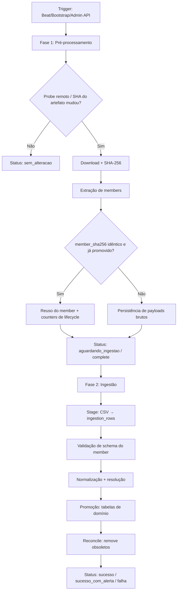
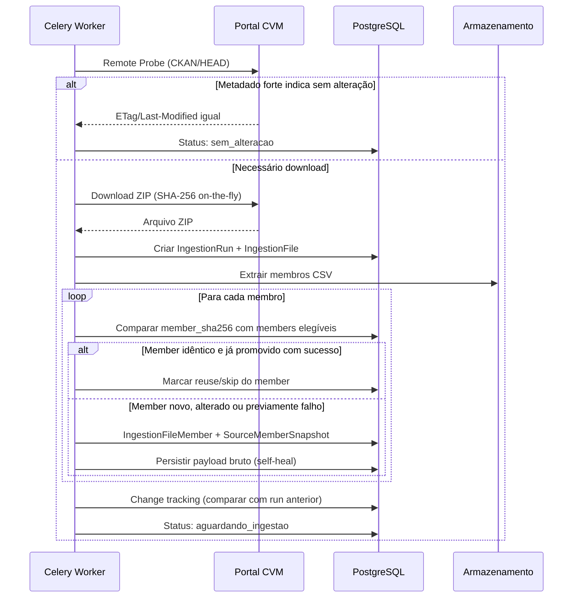
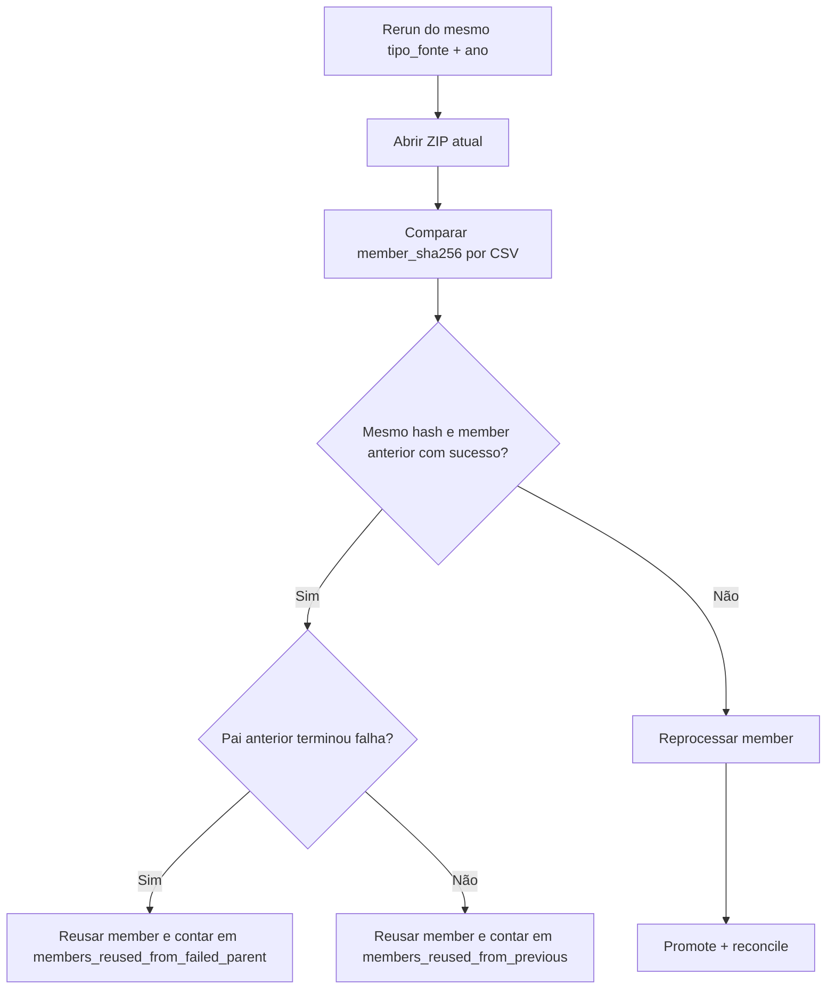
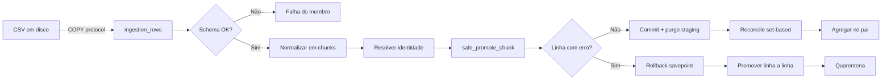
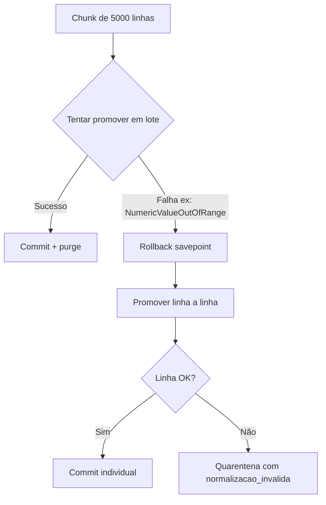
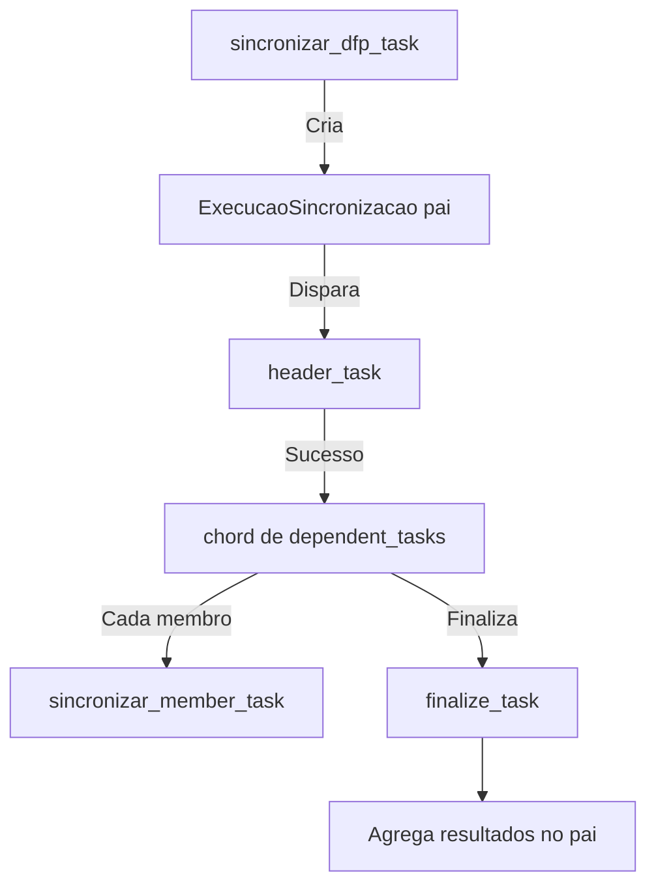

# Pipeline de Ingestão (Importação dos Dados)

## Visão Geral

O pipeline de ingestão do Tucano CVM é responsável por baixar, validar, normalizar e persistir dados públicos da CVM. Ele substitui o sistema legado de sincronização v1 e opera sobre **8 fontes de dados** públicas.

O pipeline é dividido em **duas fases estruturadas** para garantir resiliência, permitir reinícios limpos e habilitar self-healing em caso de falhas.

Para fontes anuais em ZIP, o pipeline tambem opera com **rerun orientado a recuperacao**: se uma execucao anual falhou em apenas parte dos CSVs, um novo disparo do mesmo `tipo_fonte + ano` reaproveita members ja promovidos com sucesso quando o `member_sha256` permanece identico. Isso evita reprocessar tudo de novo apenas porque um subconjunto do pacote anterior falhou.

## Arquitetura em Duas Fases



## Fase 1: Pré-processamento

A Fase 1 prepara o terreno para a ingestão sem ainda escrever nas tabelas de domínio.

### Objetivos

1. **Sondagem remota** (remote probe) para evitar downloads desnecessários
2. **Download com verificação de integridade** (SHA-256)
3. **Extração de metadados** dos membros CSV
4. **Persistência de payloads brutos** para self-healing
5. **Change tracking** estrutural entre execuções

### Fluxo Detalhado



### Decisão de Download

O sistema evita downloads desnecessários através de três níveis de deduplicação:

| Nível | Mecanismo | Descrição |
|-------|-----------|-----------|
| **Remoto** | HTTP HEAD + CKAN | Verifica ETag/Last-Modified antes do download |
| **Arquivo** | SHA-256 do ZIP | Compara com execuções anteriores |
| **Membro** | SHA-256 do CSV | Reaproveita membros idênticos |

**Resultado típico de uma sincronização:**
- `sem_alteracao`: Probe remoto forte ou SHA do artefato confirmou igualdade
- `skipped`: Compatibilidade legada ou skip administrativo explícito
- `processado`: members alterados foram ingeridos; members idênticos foram reaproveitados por `member_sha256`

## Semântica de rerun anual

Em fontes anuais como DFP, ITR, FRE, FCA, IPE, VLMO e CGVN, a unidade operacional real nao e apenas o ZIP, mas cada member CSV dentro dele. Por isso o rerun anual segue a logica abaixo:

1. o artefato anual passa normalmente por `acquire`, inclusive com probe remoto e eventual download;
2. o ZIP atual eh aberto e cada member eh comparado por `member_sha256`;
3. se um member tem o mesmo hash e ja concluiu a promocao em uma execucao anterior elegivel, ele eh reaproveitado;
4. apenas members alterados, ausentes, interrompidos ou antes marcados como falha entram novamente no hot path;
5. quando o reaproveitamento acontece a partir de uma execucao pai anual que terminou `falha`, o sistema separa esse caso em counters proprios para indicar recuperacao parcial sobre um pai falho.

Esse mecanismo eh o que torna o rerun pos-incidente mais inteligente: perder scheduler, Redis ou workers nao obriga reingestao total de todos os CSVs grandes se a maior parte deles ja havia sido promovida corretamente.



### Persistência de Payloads

Os payloads brutos de cada membro CSV são armazenados em `IngestionFileMemberPayload` (coluna `LargeBinary`). Isso permite:

- **Self-healing**: Se um worker reiniciar entre fases, o CSV pode ser reconstruído do banco
- **Replay sem redownload**: O replay de uma run não depende do arquivo original na CVM
- **Auditoria completa**: Preserva exatamente o que foi processado

## Fase 2: Ingestão

A Fase 2 executa a leitura real dos dados e escrita nas tabelas de domínio.

### Objetivos

1. **Stage**: Carregar CSVs em staging temporário (`ingestion_rows`)
2. **Validar**: Verificar schema e chaves naturais
3. **Resolver**: Identificar a companhia de cada linha
4. **Promover**: Escrever nas tabelas de domínio com resiliência
5. **Reconcile**: Remover linhas obsoletas

### Fluxo Detalhado



### Stage com COPY Protocol

Para performance, o stage usa o **COPY protocol do PostgreSQL** quando disponível:

```python
# Pseudocódigo simplificado
with db.cursor() as cur:
    cur.copy_expert(
        "COPY ingestion_rows (raw_data, row_kind, ...) FROM STDIN",
        csv_file
    )
```

**Batch size padrão:** 5.000 linhas por chunk (configurável via `INGESTION_STAGE_BATCH_SIZE`)

### Promoção Resiliente (`safe_promote_chunk`)

Este é o mecanismo mais importante para garantir que um único registro problemático não bloqueie toda a ingestão:



**Exemplo de erro tratado:**
- Valor numérico excede precisão da coluna (`NumericValueOutOfRange`)
- Estouro de campo texto
- Violação de integridade referencial
- Caracteres inválidos em encoding

## Orquestração Celery

### Hierarquia de Tasks



### Configuração de Workers

```yaml
# docker-compose.workers.yml
cvm_worker:
  command: >
    celery -A app.celery_app worker
    --loglevel=info
    --concurrency=1
    --prefetch-multiplier=1
    -Ofair
  deploy:
    replicas: 4
```

**Por que `prefetch_multiplier=1` e `-Ofair`?**
- Evita que um worker acumule tarefas na fila local enquanto outros ficam ociosos
- Garante distribuição justa de carga para tarefas de longa duração
- Permite cancelamento mais responsivo

## Status e Fases

### Fases do Pipeline

| Fase | Descrição |
|------|-----------|
| `acquire` | Sondagem remota + download do arquivo |
| `stage` | Parsing CSV → `ingestion_rows` |
| `validate` | Validação de header e schema |
| `resolve` | Resolução de identidade da companhia |
| `promote` | Escrita nas tabelas de domínio |
| `reconcile` | Remoção de linhas obsoletas |
| `complete` | Pipeline finalizado |

### Status de Execução

| Status | Descrição |
|--------|-----------|
| `agendada` | Task enfileirada no Celery |
| `em_execucao` | Processamento ativo |
| `aguardando_ingestao` | Fase 1 concluída, aguardando Fase 2 |
| `sucesso` | Ingestão finalizada sem erros |
| `sucesso_com_alerta` | Concluída com alertas (ex: erros de schema) |
| `sem_alteracao` | Arquivo fonte não mudou |
| `skipped` | Skip operacional legado ou decisão administrativa explícita |
| `falha` | Erro durante processamento |
| `falha_qualidade` | Violação do quality gate |
| `cancelada` | Abortada manualmente |

## Quality Gate

Após o processamento de cada membro, o sistema aplica um **quality gate**:

```python
# Pseudocódigo
if ratio_companhia_nao_encontrada > INGESTION_COMPANY_MISSING_MAX_RATIO:
    status = "falha_qualidade"
elif erros_schema > 0:
    status = "sucesso_com_alerta"
else:
    status = "sucesso"
```

**Configuração padrão:**
- `INGESTION_COMPANY_MISSING_MAX_RATIO = 0.01` (1%)
- Se mais de 1% das linhas não conseguirem resolver a companhia, a execução falha

## Change Tracking

O sistema rastreia mudanças estruturais entre execuções:

| Mudança | Descrição |
|---------|-----------|
| `member_added` | Membros CSV novos no pacote atual |
| `member_removed` | Membros CSV removidos do pacote |
| `required_member_missing` | Membros obrigatórios ausentes |
| `optional_member_missing` | Membros opcionais ausentes |
| `header_changed` | Colunas do header alteradas |
| `schema_changed` | Status de schema alterado |
| `row_count_changed` | Quantidade de linhas alterada |
| `delivery_index_changed` | Índice documental alterado |

Essas informações são persistidas em `change_summary` da `IngestionRun` e expostas na API em `/ingestion/runs/{run_id}`.

## Reconcile

Após a promoção, o sistema remove das tabelas de domínio os registros que estavam presentes na run anterior mas não aparecem no pacote atual.

**Por que isso é necessário?**
- A CVM republica arquivos anuais por **substituição completa**, não por append
- Se uma companhia deixou de ser listada, suas linhas antigas precisam ser removidas
- Se uma versão antiga foi substituída, as linhas da versão antiga precisam sair

**Implementação:**
```sql
-- Anti-join set-based (batches de 5000 IDs)
DELETE FROM demonstracoes_financeiras
WHERE arquivo_origem = $1
  AND ano_origem = $2
  AND hash_origem NOT IN (
    SELECT hash_origem FROM ingestion_reconcile_hashes
    WHERE run_id = $3
  )
```

## Monitoramento

### Endpoints de Monitoramento

| Endpoint | Descrição |
|----------|-----------|
| `GET /ingestion/sincronizacoes` | Lista execuções de sincronização |
| `GET /ingestion/sincronizacoes/{id}` | Detalhe de uma execução |
| `GET /ingestion/runs` | Lista runs do pipeline |
| `GET /ingestion/runs/{id}` | Detalhe de uma run (com change_summary, quality_summary, etc.) |
| `GET /ingestion/dashboard` | Dashboard consolidado |
| `GET /ingestion/quarentena` | Lista itens em quarentena |
| `GET /ingestion/quarentena/resumo` | Resumo analítico da quarentena |

### Métricas Prometheus

| Métrica | Tipo | Labels |
|---------|------|--------|
| `cvm_ingestion_rows_total` | Counter | source, status, reason |
| `cvm_ingestion_run_duration_seconds` | Histogram | source, phase |
| `cvm_ingestion_retries_total` | Counter | operation, error_type |
| `cvm_ingestion_quarantine_total` | Gauge | reason |

## Próximos Passos

- [Modelo de Dados](./data-model.md) - Entenda as tabelas do sistema
- [Resolução de Identidade](./identity-resolution.md) - Como o sistema resolve companhias
- [Quarentena e Replay](./quarantine-replay.md) - Como tratar erros e reprocessar
