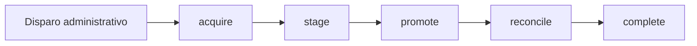
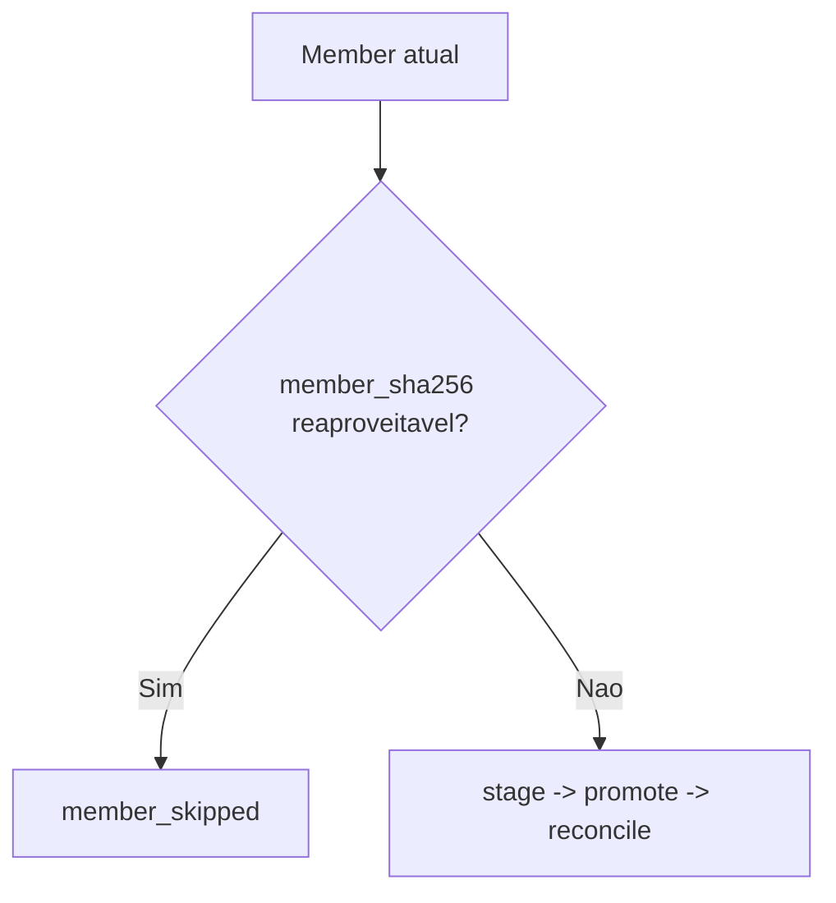

# Pipeline de Ingestao

## Visao tecnica

O pipeline de ingestao processa fontes publicas da CVM em dois niveis:

- nivel administrativo: `ExecucaoSincronizacao`
- nivel tecnico: `IngestionRun`

Para fontes anuais, o artefato principal e o ZIP. O trabalho real, porem, e decidido member a member.

## Fluxo atual



### `acquire`

- consulta metadados remotos;
- decide se o artefato precisa ser baixado;
- registra snapshot do artefato;
- prepara a run para o restante do fluxo.

### `stage`

- extrai e inventaria members;
- registra header, tamanho, encoding, delimiter e row count;
- aplica snapshots de lifecycle por member;
- produz artifacts normalizados quando o fluxo da fonte usa este caminho;
- carrega o staging operacional necessario ao promote.

### `promote`

- normaliza payloads;
- resolve companhia e relacionamentos;
- aplica deduplicacao e upsert;
- gera historico de alteracao quando ha mudanca de negocio;
- envia excecoes para quarentena.

### `reconcile`

- remove registros promovidos que ficaram obsoletos para o escopo reprocessado;
- atualiza counters operacionais da run.

## Reuso por member

Para fontes anuais, a decisao de trabalho e feita por member:



Campos que explicam essa decisao:

- `quality_summary.members_reprocessed`
- `quality_summary.members_reused_from_previous`
- `quality_summary.members_reused_from_failed_parent`
- `member_snapshot_summary`
- `lifecycle_decision`

## Artifacts normalizados

O pipeline suporta artifact normalizado por member.

Formato atual:

- `typed_csv` por default
- `parquet` como opcional de benchmark

Decisao atual do projeto:

- manter `typed_csv` como default no ambiente Docker medido;
- usar `parquet` apenas quando benchmark por fonte/member justificar.

## Quarentena

A quarentena representa excecoes persistidas de linha.

Cada item guarda:

- origem (`arquivo_origem`, `ano_origem`, `linha_origem`, `row_kind`);
- classificacao (`motivo_codigo`, `severidade`, `reparavel`);
- estado de reparo (`status`, `tentativas_reprocessamento`);
- diagnostico estruturado.

## Observabilidade

Os endpoints mais importantes para observabilidade sao:

- `GET /ingestion/runs`
- `GET /ingestion/runs/{run_id}`
- `GET /ingestion/runs/{run_id}/phases`
- `GET /ingestion/runs/{run_id}/members`
- `GET /ingestion/sincronizacoes`
- `GET /ingestion/operations`

Campos operacionais padrao:

- `state`
- `progress`
- `liveness`
- `blocking`
- `cancellation`
- `last_error`
- `next_action`

## Recovery e cancelamento

O pipeline suporta:

- cancelamento administrativo por execucao, run ou member;
- recovery administrativo de run stale ou com erro recuperavel;
- replay de run;
- replay de quarentena;
- rebuild de identidade.

O endpoint agregado `GET /ingestion/operations` existe para consumidores desacoplados que precisam de um snapshot unico do cluster, das filas e do gate de materializacao.

## Benchmarks

Benchmarks mantidos no repositorio:

- `tests/scripts/benchmark_ingestion_stage.py`
- `tests/scripts/benchmark_ingestion_member.py`
- `tests/scripts/benchmark_normalized_artifacts.py`

Benchmark oficial de artifact normalizado:

```bash
docker compose run --rm cvm_api sh -lc "pip install --no-cache-dir -e '.[parquet]' && python -m tests.scripts.benchmark_normalized_artifacts --rows 100000 --output json"
```
