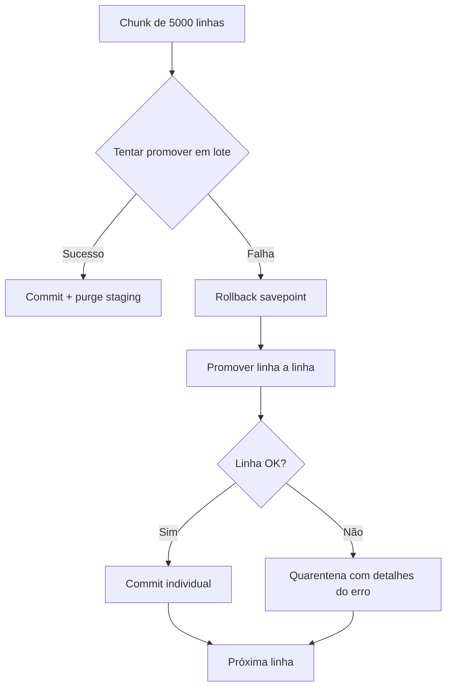

# Quarentena e Replay

## Visão Geral

A **quarentena** é o mecanismo do Tucano CVM para isolar e gerenciar linhas de dados que não puderam ser processadas com sucesso durante a ingestão. O **replay** permite reprocessar essas linhas após correções.

## Quarentena

### Quando uma Linha Vai para Quarentena

Uma linha é enviada para quarentena quando:

1. **Erro de normalização**: Falha ao converter campos (decimais, datas, etc.)
2. **Companhia não encontrada**: Nenhuma estratégia de resolução funcionou
3. **Companhia ambígua**: CNPJ e código CVM apontam para companhias diferentes
4. **Chave natural duplicada**: Mesma chave natural com dados conflitantes
5. **Erro de banco de dados**: Falha durante promoção (ex: `NumericValueOutOfRange`)

### Códigos de Erro (`motivo_codigo`)

| Código | Descrição | Reparável? |
|--------|-----------|------------|
| `normalizacao_invalida` | Erro de conversão/parse ou falha de BD | Não |
| `companhia_nao_encontrada` | Empresa não encontrada no grafo | Sim |
| `companhia_ambigua` | CNPJ e CVM conflitantes | Sim |
| `chave_natural_duplicada_conflitante` | Chave duplicada com dados divergentes | Sim |
| `schema_inesperado` | Colunas obrigatórias ausentes | Sim* |
| `denominacao_social_ausente` | Não foi possível extrair denominação | Não |
| `identidade_ausente` | Nem CNPJ nem CVM disponíveis | Não |

*`schema_inesperado` é tratado em nível de membro, não explode em milhares de itens de quarentena.

### Estrutura de um Item de Quarentena

```json
{
  "id": "0ebc5c67-25a4-4e0c-ab25-66eaf4af4ced",
  "ingestion_run_id": "6a31c7f8-1c89-4f3d-87db-7e6a8e196999",
  "ingestion_row_id": "9b3a4f45-b7ab-4de6-a93d-95f85913df71",
  "arquivo_origem": "itr_cia_aberta_2021.csv",
  "ano_origem": 2021,
  "linha_origem": 1692,
  "row_kind": "itr_documento",
  "status": "pendente",
  "motivo_codigo": "companhia_nao_encontrada",
  "severidade": "error",
  "reparavel": true,
  "tentativas_reprocessamento": 1,
  "diagnostico": {
    "codigo_cvm": 3,
    "denominacao_companhia": "EMPRESA FINANCEIRA",
    "resolution_method": "none"
  }
}
```

### Status da Quarentena

| Status | Descrição |
|--------|-----------|
| `pendente` | Aguardando resolução |
| `resolvido_auto` | Resolvido automaticamente por replay |
| `resolvido_manual` | Resolvido manualmente por operador |
| `ignorado` | Marcado para ignorar |

### Consultando a Quarentena

#### Listar Itens

```bash
GET /ingestion/quarentena?pagina=1&tamanho_pagina=100
```

**Filtros disponíveis:**
- `motivo_codigo`: Filtrar por tipo de erro
- `arquivo_origem`: Filtrar por arquivo
- `status`: Filtrar por status
- `ano_origem`: Filtrar por ano

**Exemplo:**
```bash
GET /ingestion/quarentena?motivo_codigo=companhia_nao_encontrada&status=pendente
```

#### Resumo Analítico

```bash
GET /ingestion/quarentena/resumo
```

**Resposta:**
```json
{
  "total": 42,
  "por_status": {
    "pendente": 35,
    "resolvido_auto": 5,
    "resolvido_manual": 2
  },
  "por_erro": [
    {"motivo_codigo": "companhia_nao_encontrada", "quantidade": 28},
    {"motivo_codigo": "normalizacao_invalida", "quantidade": 10},
    {"motivo_codigo": "chave_natural_duplicada_conflitante", "quantidade": 4}
  ],
  "por_arquivo": [
    {"arquivo_origem": "itr_cia_aberta_2021.csv", "quantidade": 15},
    {"arquivo_origem": "dfp_cia_aberta_2022.csv", "quantidade": 12}
  ],
  "por_arquivo_e_erro": [
    {
      "arquivo_origem": "itr_cia_aberta_2021.csv",
      "motivo_codigo": "companhia_nao_encontrada",
      "quantidade": 10
    }
  ]
}
```

## Replay

### Tipos de Replay

O sistema suporta **3 níveis de replay**:

#### 1. Replay de Linha Individual

**Uso:** Reprocessar uma única linha rejeitada.

```python
# Interno (não exposto via API diretamente)
replay_ingestion_row(row_id)
```

**Características:**
- Renormaliza, re-resolve e re-promove uma linha
- Resiliente: falha em uma linha não aborta as demais
- Usado internamente pelo replay de quarentena

#### 2. Replay de Quarentena

**Uso:** Reprocessar todos os itens pendentes na quarentena.

```bash
POST /ingestion/replay/quarentena
Content-Type: application/json

{
  "reason_code": "companhia_nao_encontrada",
  "arquivo_origem": "itr_cia_aberta_2021.csv",
  "ano": 2021
}
```

**Filtros opcionais:**
- `reason_code`: Filtrar por tipo de erro
- `arquivo_origem`: Filtrar por arquivo
- `ano`: Filtrar por ano

**Comportamento:**
- Opera apenas sobre itens com `status=pendente`
- Se nenhum filtro for enviado, considera todos os pendentes
- Não reprocessa linhas bem-sucedidas (apenas exceções)

**Resposta:**
```json
{
  "status": "sucesso",
  "detalhe": {
    "total": 10,
    "promovidos": 8,
    "inalterados": 1,
    "falhas": 1,
    "items": [
      {"row_id": "...", "status": "promovido"},
      {"row_id": "...", "status": "falha", "erro": "..."}
    ]
  }
}
```

#### 3. Replay de Run Completa

**Uso:** Reprocessar uma run inteira a partir do payload bruto retido.

```bash
POST /ingestion/runs/{run_id}/replay
```

**Características:**
- Reconstrói o processamento a partir de `IngestionFileMemberPayload`
- Não depende da permanência das linhas bem-sucedidas em staging
- Passa novamente por `stage`, `promote` e `reconcile`
- Útil quando uma correção de parser ou regra de reparo precisa ser aplicada em lote

**Quando usar:**
- Após corrigir um bug no normalizador
- Após aplicar novas regras de reparo
- Quando o payload bruto foi retido mas as linhas foram perdidas

## Promoção Resiliente (`safe_promote_chunk`)

Este mecanismo é crucial para entender como a quarentena é populada:



**Exemplo de erro capturado:**
```json
{
  "motivo_codigo": "normalizacao_invalida",
  "diagnostico": {
    "error_type": "NumericValueOutOfRange",
    "field": "valor_conta",
    "value": "99999999999999999999",
    "column_precision": 20,
    "message": "valor excede precisão da coluna"
  }
}
```

## Fluxo de Trabalho Típico

### Cenário 1: Muitas Companhias Não Encontradas

```bash
# 1. Ver resumo da quarentena
GET /ingestion/quarentena/resumo

# 2. Listar itens específicos
GET /ingestion/quarentena?motivo_codigo=companhia_nao_encontrada

# 3. Sincronizar cadastro (se desatualizado)
POST /ingestion/sincronizacoes/cadastro

# 4. Reconstruir grafo de identidade
POST /ingestion/identity/rebuild

# 5. Replay da quarentena
POST /ingestion/replay/quarentena
{
  "reason_code": "companhia_nao_encontrada"
}

# 6. Verificar resultado
GET /ingestion/quarentena/resumo
```

### Cenário 2: Erros de Normalização

```bash
# 1. Identificar padrões
GET /ingestion/quarentena?motivo_codigo=normalizacao_invalida

# 2. Analisar diagnóstico
# (Ver campo "diagnostico" de cada item)

# 3. Se for bug no normalizador:
#    - Corrigir código
#    - Deploy
#    - Replay de run completa
POST /ingestion/runs/{run_id}/replay

# 4. Se for dado inválido na fonte:
#    - Marcar como "ignorado" (manual)
#    - Ou aguardar próxima sincronização
```

### Cenário 3: Chaves Duplicadas Conflitantes

```bash
# 1. Listar conflitos
GET /ingestion/quarentena?motivo_codigo=chave_natural_duplicada_conflitante

# 2. Analisar qual versão é correta
# (Comparar "diagnostico" das linhas conflitantes)

# 3. Se necessário, criar regra de reparo
POST /ingestion/repair-rules
{
  "tipo": "dedup_priority",
  "match_fields": {"natural_key": "..."},
  "priority_field": "versao",
  "priority_order": "desc"
}

# 4. Replay
POST /ingestion/replay/quarentena
{
  "reason_code": "chave_natural_duplicada_conflitante"
}
```

## Tolerância a Formatos

O normalizador foi robustecido para tolerar formatos comuns em dados públicos brasileiros:

### Formatos Suportados

| Tipo | Exemplos Aceitos |
|------|------------------|
| **Monetário** | `R$ 1.234,56`, `1234.56`, `1,234.56` |
| **Percentual** | `12,5%`, `12.5%`, `0.125` |
| **Decimal** | `1.234,56` (BR), `1,234.56` (US) |
| **Nulos** | `N/A`, `N.D.`, `-`, ``, `null` |
| **Texto em campos numéricos** | `TJLP + 1,72% a.a.`, `100% do CDI` |

### Fallback para Texto

Quando um campo originalmente numérico contém texto livre (ex: taxas de juros descritivas), o sistema faz fallback para tipo `Text` no banco:

```python
# Antes (falhava)
valor = parse_decimal("TJLP + 1,72% a.a.")  # Erro!

# Agora (suporta)
if is_numeric(value):
    return parse_decimal(value)
else:
    return value  # Preserva como texto
```

## Métricas e Monitoramento

### Métricas Prometheus

```
# Total de itens em quarentena por motivo
cvm_ingestion_quarantine_total{reason="companhia_nao_encontrada"} 28
cvm_ingestion_quarantine_total{reason="normalizacao_invalida"} 10

# Linhas processadas por status
cvm_ingestion_rows_total{source="dfp",status="valid"} 15234
cvm_ingestion_rows_total{source="dfp",status="invalid"} 42
```

### Dashboard

```bash
GET /ingestion/dashboard
```

**Resposta:**
```json
{
  "total_execucoes": 150,
  "total_sucesso": 145,
  "total_sem_alteracao": 3,
  "total_falha": 2,
  "total_rejeitados": 42,
  "ultimas_execucoes": [...]
}
```

## Boas Práticas

### 1. Monitore Regularmente

```bash
# Ver resumo diário
GET /ingestion/quarentena/resumo

# Alertar se > 100 itens pendentes
if resumo.total > 100:
    alert("Quarentena acumulando")
```

### 2. Priorize Erros Reparáveis

Foque primeiro em erros com `reparavel=true`:
- `companhia_nao_encontrada`
- `companhia_ambigua`
- `chave_natural_duplicada_conflitante`

### 3. Use Replay Seletivo

Em vez de replayar tudo, filtre por tipo de erro:

```bash
# Replay apenas de companhias não encontradas
POST /ingestion/replay/quarentena
{
  "reason_code": "companhia_nao_encontrada"
}
```

### 4. Documente Regras de Reparo

Mantenha um log de regras criadas:

```markdown
## Regras de Reparo Criadas

### 2026-06-15
- **CNPJ antigo da Empresa X**: `12345678000199` → `uuid-empresa-x`
  - Motivo: Empresa mudou de CNPJ em 2020
  - Arquivos afetados: DFP 2019, ITR 2019
```

### 5. Não Ignore Erros de Normalização

Erros com `motivo_codigo=normalizacao_invalida` geralmente indicam:
- Bug no normalizador (corrigir código)
- Dado inválido na fonte (reportar à CVM)
- Mudança de layout (atualizar mapeamento)

## Próximos Passos

- [Pipeline de Ingestão](./ingestion-pipeline.md) - Entenda o fluxo completo
- [Resolução de Identidade](./identity-resolution.md) - Como o sistema resolve companhias
- [API Endpoints](../ingestion/overview.md) - Endpoints administrativos