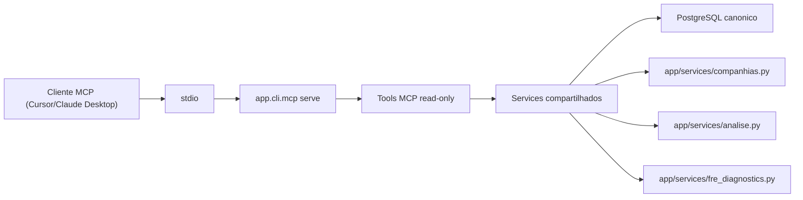

# MCP Analitico Read-Only

O Tucano CVM expoe um servidor **Model Context Protocol (MCP)** para consultas analiticas read-only. Ele pode rodar localmente via `stdio` ou ser montado na mesma instancia FastAPI da API REST em `/mcp` quando `MCP_HTTP_ENABLED=true`.

O MCP nao substitui a API HTTP. Ele nao executa ingestao, nao dispara materializacao, nao executa repair, nao cancela runs, nao controla filas e nao aceita SQL arbitrario.

## Arquitetura



Regras obrigatorias:

- tools MCP chamam services compartilhados, nunca handlers FastAPI;
- tools MCP nao implementam regra de negocio propria;
- tokens REST/API nao concedem acesso MCP automaticamente;
- respostas mascaram segredos e connection strings;
- `include_raw=false` e o padrao para reduzir payloads.

## Execucao Local

Valide a CLI local:

```bash
docker compose run --rm cvm_api python -m app.cli.mcp --help
docker compose run --rm cvm_api python -m app.cli.mcp smoke-test
```

Inicie o servidor via `stdio`:

```bash
docker compose run --rm -i cvm_api python -m app.cli.mcp serve
```

Em Kubernetes, a instancia principal da API pode servir REST e MCP no mesmo host:

```text
https://cvm.tucano.beakcloud.com/      # REST
https://cvm.tucano.beakcloud.com/mcp   # MCP Streamable HTTP
```

## Variaveis de Ambiente

| Variavel | Descricao | Padrao |
|----------|-----------|--------|
| `MCP_PROFILE` | Perfil MCP. Neste corte, somente `analyst` e aceito. | `analyst` |
| `MCP_HTTP_ENABLED` | Monta o servidor MCP HTTP na instancia FastAPI em `/mcp`. | `false` |
| `MCP_HTTP_REQUIRE_BEARER` | Exige `Authorization: Bearer <MCP_TOKEN>` para qualquer request HTTP em `/mcp`. | `true` |
| `MCP_REQUIRE_TOKEN` | Exige token MCP no argumento `token` de cada ferramenta. | `false` |
| `MCP_TOKEN` | Token exclusivo do MCP. Nao e o token REST/API. | vazio |
| `MCP_MAX_ROWS` | Limite de linhas retornadas por ferramenta. | `50` |
| `MCP_MAX_PERIODS` | Limite de periodos em ferramentas analiticas. | `20` |
| `MCP_TOOL_TIMEOUT_SECONDS` | Limite operacional configurado para ferramentas. | `30` |
| `MCP_INCLUDE_RAW_DEFAULT` | Inclui payload bruto dos schemas REST por padrao. | `false` |

Quando `MCP_HTTP_ENABLED=true`, publique o endpoint `/mcp` somente com TLS e `MCP_HTTP_REQUIRE_BEARER=true`. O cliente deve enviar `Authorization: Bearer <MCP_TOKEN>`. Quando `MCP_REQUIRE_TOKEN=true`, informe tambem o valor de `MCP_TOKEN` no argumento `token` da tool chamada pelo cliente MCP. O token administrativo REST (`TUCANO_CVM_TOKEN`) nao e aceito como substituto.

## Configuracao no Claude Desktop

Exemplo local usando Docker Compose:

```json
{
  "mcpServers": {
    "tucano-cvm": {
      "command": "docker",
      "args": [
        "compose",
        "run",
        "--rm",
        "-i",
        "cvm_api",
        "python",
        "-m",
        "app.cli.mcp",
        "serve"
      ],
      "env": {
        "MCP_PROFILE": "analyst",
        "MCP_REQUIRE_TOKEN": "false"
      }
    }
  }
}
```

## Configuracao no Cursor

Use a mesma forma de comando `stdio` no arquivo MCP do workspace:

```json
{
  "mcpServers": {
    "tucano-cvm": {
      "command": "docker",
      "args": [
        "compose",
        "run",
        "--rm",
        "-i",
        "cvm_api",
        "python",
        "-m",
        "app.cli.mcp",
        "serve"
      ]
    }
  }
}
```

## Ferramentas

### `healthcheck`

Retorna status do servidor, transporte, perfil, lista de ferramentas read-only e limites aplicados.

### `buscar_companhias`

Busca companhias abertas pelos mesmos filtros do service de companhias.

Argumentos principais:

- `cnpj_companhia`
- `codigo_cvm`
- `nome`
- `situacao_registro`
- `ordenar`
- `pagina`
- `tamanho_pagina`
- `include_raw`

### `listar_metricas_analise`

Retorna catalogo compacto das metricas analiticas canonicas: id, nome, tipo, unidade, formula, bases disponiveis e limitacoes.

### `obter_coverage_companhia`

Retorna matriz de cobertura por periodo para uma companhia.

Argumentos principais:

- `codigo_cvm`
- `escopo`: `consolidated` ou `individual`
- `periodicidade`: `annual` ou `quarterly`
- `base_periodo`: `fy`, `quarter` ou `ytd`
- `as_of`
- `horizonte_anos`
- `include_raw`

### `obter_diagnostico_series`

Explica lacunas de series usando os reason codes e remediation codes da camada analitica canonica.

Argumentos principais:

- `codigo_cvm`
- `metricas`: lista separada por virgula, por exemplo `receita_liquida,lucro_liquido`
- `periodicidade`
- `base_periodo`
- `escopo`
- `as_of`
- `horizonte_anos`
- `include_raw`

### `obter_series_temporais`

Retorna observacoes canonicas de series temporais, indisponibilidades, resolucao aplicada e issues.

### `obter_brief_companhia`

Retorna brief financeiro deterministico com periodos de referencia, metricas, comparacoes, sinais, qualidade, eventos e issues.

### `obter_disponibilidade_fre_dataset`

Diagnostica disponibilidade de datasets FRE por ano e dataset, preservando os mesmos diagnosis codes do service REST.

Argumentos principais:

- `ano`
- `ano_inicio`
- `ano_fim`
- `datasets`: lista separada por virgula, por exemplo `auditores,capital_social`
- `include_raw`

## Respostas Compactas

Toda ferramenta retorna um envelope JSON:

```json
{
  "tool": "obter_diagnostico_series",
  "ok": true,
  "limits": {
    "max_rows": 50,
    "max_periods": 20
  }
}
```

Erros retornam `ok=false`, tipo e mensagem, sem stack trace:

```json
{
  "tool": "obter_series_temporais",
  "ok": false,
  "error": {
    "type": "ValueError",
    "message": "Companhia nao encontrada para codigo_cvm=999999."
  }
}
```

Use `include_raw=true` somente quando o cliente precisar do payload completo serializado dos schemas compartilhados.
